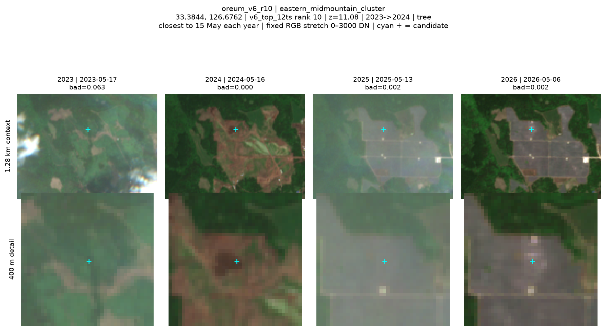

# Ai2 미팅 준비 — 제주 오름에서 시작한 OLMoEarth 활용과 기여

2026-09-10. 기본안: 10분 소개 + 대화. 상대/미팅 길이는 미확인.
이 문서는 개인 준비용이며 발송·공개배포·새 실험은 하지 않았다.

## 핵심 메시지

> **OLMoEarth를 한국의 보전 모니터링에 직접 적용하면서, 임베딩으로 조사 후보를 만들고
> 원본 영상·한국 공공기록으로 검토하는 과정을 구현했습니다. 그 과정에서 입력 품질과
> 시간 정렬의 문제를 재현했고, 개선 예제와 작은 upstream 기여로 돌려드리고 싶습니다.**

오늘의 목표는 “오름 훼손 탐지 성공”이나 CVPR 가능성을 설득하는 것이 아니다.
**실제 사용 사례, 동작하는 구현, 확인한 한계, 팀과 함께 닫을 작은 다음 과제**를 보여준다.
새로운 모델 방법을 발명했다거나 환경 피해 감소를 검증했다는 뜻은 아니다.

## 1. 오름 실험은 어떤 점에서 유의미했나?

| 자산 | 확인한 내용 | 미팅에서 허용되는 설명 |
|---|---|---|
| 지역화된 조사 workflow | 공식 오름 목록368개, OSM 위치 후보243개, 나머지125개 미해결 표시 | “빠진 장소까지 보이게 만든 목록·지도·검토 과정” |
| 임베딩 활용 | 제주 시계열 embedding으로 후보 순위 생성, 고정14후보의 RGB 비교 페이지 | “EO 표현을 실제 조사 후보로 연결했다”; 정확도 검증 완료는 아님 |
| 육안 검토 후보 | 보존된 assistant RGB 판정에서 지속 변화5records/4고유site | “후속 검증할 토지 변화 사례”; 현장 전문가 ground truth 아님 |
| 입력 품질 개선 | 한 사전 지정 window의4기간에서 장면선택 변경 후 bad proxy95.64% 감소 | “입력 품질 개입의 재현 예제”; 탐지 정확도95.64% 향상 아님 |
| 한국 데이터 결합 | 공식 목록·FarmMap·지적/PNU·건축/EIA를 출처와 시간 조건으로 연결 | “모델 후보를 국내 확인 자료와 결합”; 주변 허가가 원인이라는 뜻 아님 |
| upstream 환류 | SCL scoring/보조자산·소비 timestep 문서 후보로 정리 | “구체적 friction을 작은 재현과 테스트로 기여하겠다” |

### 서로 다른 두 표본을 섞지 않기

1. **제주 전역/중산간 후보14records:** 초기 탐색에서 선택한 지점들이다. 기존 assistant RGB
   검토는4고유site의 지속 변화 형태를 제안했다. 지명에 oreum이 들어가도 공식 오름 경계 안으로
   검증된 것이 아니다. 일부는 개발/시설 인접지다. 검토문서 상태는 user override pending이다.
2. **공식 오름368개 중 위치 연결243개:** 오름점에서 4기간/12기간 모두 높았던8개 후보는
   기존 RGB 검토에서 모두 구름·해무 영향으로 기각됐다. 추가1개는 불확실.
   “오름8개 훼손 발견”으로 말하면 안 된다.

14후보의 추후 시간 감사에서9건이 두 시간계약 결함 중 하나에 노출됐다. 2025/rolling2026
입력창이184일 겹쳤고 계절도 맞지 않았다. RGB상 변화 형태와 잘못된 연간 score의 타당성은 별개다.
따라서 현재 지도는 **역사적 탐색·디버깅 사례**로 제시하고 현행 위험/정확도 제품으로 시연하지 않는다.

## 2. 10분 이야기 순서

### 0:00–1:00 — 누구의 어떤 일을 돕고 싶었나

“제주에는 많은 오름과 주변 토지가 있습니다. 보전 담당자가 모든 영상을 일일이 보는 대신
새로 확인할 곳을 찾고, 왜 후보인지 영상과 지역 자료를 함께 볼 수 있게 하고 싶었습니다.”

현장 파트너/정식 배포는 확인된 사실이 아니므로 “담당자가 사용 중”이라고 말하지 않는다.
Oreum은 짧게 **Jeju's volcanic cones**로 설명한다.

### 1:00–3:00 — OLMoEarth로 실제 무엇을 했나

“Sentinel-2를 OLMoEarth 표현으로 만들고, 위치별 유사도와 시점 간 차이로 후보를 생성했습니다.
후보마다 원본 RGB·실제 취득일·공공자료 연결을 준비했습니다.”

아래 r10을 예로 보여준다. 위성사진에 보이는 녹색→갈색→회색의 변화 형태를 설명하되
시설 종류·훼손·위법·오름 경계는 말하지 않는다. 과거 순위/z값은 보정된 확률이 아니다.

**주의:** 위 그림은 이미 선택된 한 사례다. 지도 전체의 detection precision이나 표본대표성 증거가 아니다.
2025 영상의 연무도 보이므로 완전 cloud-free 비교라고 부르지 않는다.

### 3:00–5:00 — 실제로 부딪혔고 개선한 부분

“하지만 높은 embedding distance가 항상 땅의 변화는 아니었습니다. 구름·기간 선택이 순위를
바꿨습니다. 그래서 실제 입력 scene·시점을 추적하고 SCL 기반 장면 선택을 시험했습니다.”

보여줄 그림: [SCL 장면선택 전후](../artifacts/figures/v7_rgb_pairs.png).
마지막 행의 동일 target에서 구름으로 가렸던 입력이 다른 장면 선택으로 바뀐 것을 설명한다.
여기서 v1/v7은 **우리 pipeline 버전**이며 OLMoEarth 모델 릴리스 비교가 아니다.

- 첫4기간 bad proxy의 상대 감소95.64%를 원 JSON에서 확인했다.
- proxy는 B02 밝기/zero 기반이며 정확한 cloud fraction/정답 마스크는 아니다.
- 더 많은 candidate scenes와 SCL 선택·resampling 처리가 함께 바뀐 실험이다.
  “nearest 하나가95.64%를 만들었다”는 단독 인과 실험이 아니다.
- 모델이 구름 뒤 픽셀을 생성/복원한 것이 아니다. 입력 source selection 개선이다.
- 한 golden window만의 결과이며 이후 오름 전체 탐지 성능은 아직 재검증하지 않았다.

### 5:00–7:00 — 왜 연구가 공유·갱신 캐시로 이어졌나

“이 경험에서 질문이 생겼습니다. 입력을 제대로 맞춘 뒤에도 새 영상이 올 때마다 과거를
전부 다시 인코딩해야 할까요? 같은 표현을 여러 분석기가 공유하고 저렴하게 갱신할 수 있을까요?”

이것이 **동기 연결**이다. 초기 오름 실험이 이후 streaming 방법의 정확성을 검증한 것은 아니다.
현재 한국은 한 static cache→세 신규 head까지 실행했고, 한국 공유 streaming은 아직 안 했다.
산사태/홍수 streaming은 별도 개발 결과이며 일반적 실시간 운영 성공으로 포장하지 않는다.
한국 FULL 비교에는 오늘 발견한 cutoff/노출량 등 수정 항목이 있어 메인 성능표로 내세우지 않는다.

### 7:00–10:00 — 작은 기여와 명확한 질문

“먼저 sample schema 수정처럼 작은 기여부터 하고 싶습니다. 제주 사례는 scene-quality/
temporal provenance를 포함한 공개 예제나 회귀 테스트로 정리할 수 있을 것 같습니다.
팀에 가장 도움이 되는 형태가 무엇인지 의견을 듣고 싶습니다.”

첫 PR은 [sample 영문 초안](../pr_bodies/01_sample_schema.md),
전체 후보는 [PR 재진입 목록](PR_REENTRY_2026_09_10.md).
SCL 관련 후보의 target은 **rslearn**이고 sample schema의 target은 **olmoearth_projects**다.
8/26 이후 upstream 중복·해결 여부는 제출 전 다시 확인해야 한다.

## 3. 60–90초 영문 소개

> I started with a concrete conservation-monitoring use case in Jeju, South Korea:
> helping reviewers decide where to inspect landscape change around volcanic cones.
>
> I used OlmoEarth embeddings to generate candidates, then connected them to dated
> Sentinel-2 imagery and Korean geospatial records for review. I organized the official
> list of 368 sites, with location candidates for 243. That is coverage of the workflow,
> not 368 verified change detections.
>
> The most useful lesson was that cloud contamination and temporal selection could
> dominate the embedding-change rankings. I traced those issues to the input pipeline
> and tested an SCL-aware scene-selection improvement on a fixed window. I also found
> several concrete opportunities for documentation and small upstream contributions.
>
> That led to my current research on reusing and updating Earth embeddings as new
> observations arrive. I would like your feedback on which contribution would be most
> useful: a reproducible regional example, input-quality regression tests, or evaluation
> of incremental embedding updates.

취업 의사를 자연스럽게 덧붙이고 싶다면:

> I'm interested in contributing at the intersection of geospatial ML and reliable
> deployment. I'd love to understand where that profile could be most useful to the team.

## 4. 질문은 세 개만 우선 묻기

1. **“For change-monitoring applications, what temporal-compositing and quality-mask
   recipe do you currently recommend?”**
   우리가 만든 규칙을 팀의 의도된 contract와 맞추려는 질문이다.
2. **“Would a small Jeju example with scene provenance and input-quality regression
   tests be useful upstream, and which repository should own it?”**
   PR 범위·리뷰 담당자·연구 prototype과 production API 경계를 정한다.
3. **“For your embedding roadmap, which bottleneck matters most today: extraction,
   freshness, cross-version compatibility, or downstream adaptation?”**
   우리 연구를 강요하지 않고 팀의 실제 우선순위와 맞춘다.

기술적 관심이 이어질 때만 partial-band masking, export input manifests, immutable cache identity,
shared multi-task incremental update의 평가 형식을 더 묻는다.

**미팅 종료 시 목표:** 한 가지 follow-up 산출물과 그 리뷰 경로를 합의한다.
예: 최신 sample-schema replay+PR / 한-window SCL test / 날짜 정렬된 change-monitoring 예제.
동의 없이 자료 전송·공개·파트너 연결을 약속하지 않는다.

## 5. 지금 Ai2 방향과 맞는 이유 — 공식 자료로 확인

Ai2는 2026-04-23 embedding 소개에서 similarity search·few-shot segmentation·change detection을
이미 설명하고, 구름과 입력 품질의 한계도 명시한다. 따라서 이 기능들을 우리가 처음 발견했다고
주장할 필요가 없다. **한국 데이터에서의 실제 재현·운영 문제·검증 가능한 개선**을 보여준다.
[공식 embedding 소개](https://allenai.org/blog/olmoearth-embeddings)

2026-07-28 인프라 글에는 새 관측 기반 실행, 변화 알림, 전지구 embedding 사전계산이 로드맵으로
제시돼 있다. 그래서 오름 사례와 공유/갱신 연구는 이야기 연결성이 있다. 이는 공개 로드맵과의
정합성이지 팀의 현재 내부 최우선 과제/채용 관심을 확인했다는 뜻은 아니다.
[공식 인프라·로드맵](https://allenai.org/blog/olmoearth-infrastructure)

## 6. 자료 선택과 제출 전 주의

- 오늘 보여줄 것: **r10 RGB 한 장 → SCL 전후 한 장 → 작은 기여 목록**. 368행 대시보드는 질문 시만.
- 원 dashboard에는 이후 정정 전 문구가 남을 수 있다. `historical exploratory run`이라고 밝히고
  현재 위험지도/불법행위 탐지로 읽히지 않게 한다. 전체 서버화면·.env·개인 API응답은 보여주지 않는다.
- Sentinel 영상·OSM·국내 원자료의 출처를 유지한다. 이 준비는 원시 자료 재배포 허가의 검증이 아니다.
- LFMC는 질문이 나오면 재현 보고로 다룬다. “잘못 업로드했다” 단정이나 초반 버그 나열을 피한다.
- 연구 실험번호를 먼저 말하지 않는다. **지역 문제 → 구현 → 확인한 한계 → 개선 → 팀의 필요** 순서다.

### 확인한 로컬 근거

- `artifacts/human_review_v1/assistant_review.json`: assistant review, user override pending;14records/4unique.
- `artifacts/external_data/kearth_oreum_v1/rgb_review/assistant_review.json`:8기각/1불확실.
- `artifacts/results/jeju_candidate_time_contract_audit.json`:184일 중첩·9/14 노출.
- `artifacts/results/v7_summary.json` + `v7_rgb_manual_review.json`: 한-window proxy/육안 결과.
- 오늘 두 이미지 실물을 열어 확인했다. 새 영상/후보/성능을 생성하지 않았다.
