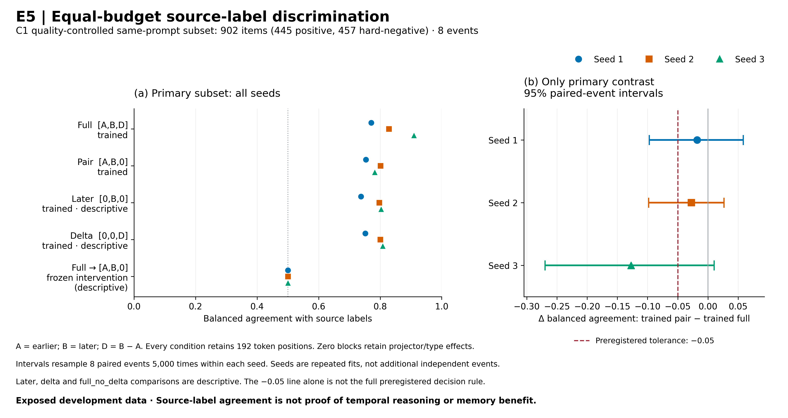

# E5 결과: 평가 시 차이 제거와 차이 없이 재학습하기

**등록 주판정은 `mixed_or_inconclusive`다.** 차이 입력 없이 학습한 모델이 전체 입력 모델의 성능을 보존한다는 기준도, 명시적 차이가 일관되게 유리하다는 기준도 통과하지 못했다. 이미 노출된 개발 사건 8개에서 얻은 결과이며, 새로운 사건 일반화·시간 추론·기억 효과의 증거로 쓰지 않는다.

그럼에도 후속 연구 방향을 바꾸는 관측은 있다. 전체 입력으로 학습한 모델에서 평가 때만 차이 `D`를 0으로 바꾸면 5,265개 답이 모두 `no`가 됐다. 반면 처음부터 `[A,B,0]`으로 같은 예산을 학습한 모델은 원 라벨에 대한 사건평균 균형정확도(BA) .7533/.8009/.7821을 얻었다. **입력 제거로 생긴 붕괴만으로 남은 입력의 학습 가능성이나 정보 부족을 판단할 수 없다.** 이는 사전에 정한 보조 비교의 관측이며 주판정 통과로 바꾸지 않는다.

## 실험과 검증 범위

2026-09-25 07:47:56 UTC에 12개 모델 학습·26,325개 응답 생성을 완료했다. 모델 작업 기록은 5,710.58초(약95.2분)이며 입력 준비·업로드·감사 시간은 포함하지 않는다. 실행 명세와 판정 기준은 결과 열람 전에 고정했다.

- 네 입력: `full=[A,B,D]`, `pair=[A,B,0]`, `later=[0,B,0]`, `delta=[0,0,D]`, `D=B−A`.
- 세 seed 각각 같은 초기 projector 상태, 같은 4,234개 훈련 문항과 배치 순서, 3 epoch. 모델당 1,590 update·12,702회 문항 노출.
- frozen Olmo-3-7B에 EO 토큰을 전달하는 projector를 학습했다. 192개 토큰 위치와 타입을 유지했으며 0 입력도 bias·정규화·타입 임베딩을 거친다. 전체 VLM을 다시 학습한 것은 아니다.
- 12개 모델의 native 평가 각1,755개와 full 세 모델의 평가 시 차이 제거 각1,755개, 합계26,325개. seed 선택·조기 종료는 없다.
- 주분석은 같은 사건·질문·날짜·슬롯, 라벨 피복률≥.90인 양성445/음성457, 총902문항·8사건이다. 층 내 BA→사건 내 층 평균→사건 동일 가중 평균으로 집계한다.
- 유일한 주대조는 `pair − full`. 같은 사건을 두 조건에서 함께 재표집하는 bootstrap 5,000회·95% percentile 구간을 seed별로 계산한다. 세 seed는 추가 독립 사건이 아니다.

[서버 독립 감사](../artifacts/e5_equal_budget_v0_review_20260925/e5_independent_audit_20260925.json)가 응답·원 입력·학습19,080step/152,424노출·초기/최종 checkpoint를 확인했다. `--check-tensors`로 CPU tensor를 실제 열어 해시를 검산했고 `consistent=true`다. 로컬 복제본은106파일의 원 감사 SHA와 일치하며28개 대형 파일은 내려받지 않았다. 로컬에서 전체 tensor 감사를 다시 했다고 주장하지 않는다. 별도 [과학 검토](../artifacts/E5_SCIENTIFIC_RESULT_REVIEW_20260925.json)는 실제26,325응답을 읽어 모든 주점수·구간·규칙과 제거 조건의 답 빈도를 재집계했다.

## 주점수와 등록 판정

| 입력 / 평가 | Seed1 | Seed2 | Seed3 |
|---|---:|---:|---:|
| full 학습·평가 | .7712 | .8284 | .9094 |
| pair 학습·평가 | .7533 | .8009 | .7821 |
| later 학습·평가 — 보조 | .7373 | .7969 | .8029 |
| delta 학습·평가 — 보조 | .7514 | .8004 | .8080 |
| full 학습 후 D=0 평가 — 보조 | .5000 | .5000 | .5000 |

| Seed | 주대조 pair−full | 사건 bootstrap 95% 구간 | 보존 규칙 | 차이 이점 규칙 |
|---|---:|---|---|---|
| 1 | −.0179 | [−.0971, +.0584] | 불통과 | 불통과 |
| 2 | −.0275 | [−.0981, +.0267] | 불통과 | 불통과 |
| 3 | −.1273 | [−.2696, +.0103] | 불통과 | 불통과 |

보존은 같은 seed에서 두 BA≥.60, 구간 하한≥−.05를 적어도2/3 seed가 만족해야 한다. 세 seed 모두 하한이−.05보다 낮아 **0/3**이다. 차이 이점은 full BA≥.60, 점수 차이≤−.10, 구간 상한<0를2/3 seed에서 요구한다. seed3의 점수 차이는−.10보다 작지만 구간이0을 포함해 이 규칙도 **0/3**이다.

따라서 첫 두 seed의 작은 점수 차이만 골라 동등하다고 할 수 없고, 세 번째 seed만 골라 차이 입력의 일관된 이점을 주장할 수도 없다. 구간이0을 포함한다는 사실은 동등성의 증거가 아니다. .05/.10은 운영상 정한 폭이며 재난 의사결정 비용에서 얻은 기준이 아니다.

[PDF](../artifacts/e5_equal_budget_figure_v1_20260925/e5_equal_budget.pdf) · [정확 수치·그림 출처](../artifacts/e5_equal_budget_figure_v1_20260925/plot_provenance.json). 첫 렌더의 잘린 왼쪽 설명을 줄바꿈으로 수정한 v1이다. 수치·축·조건은 바꾸지 않았고 이전 그림도 보존했다.

## 사전 지정 보조 관측: 재학습의 회복

`pair 학습 − full 학습 후 D 제거`의 BA 차이와 사건 bootstrap 구간은 아래와 같다. 새로운 주가설로 바꾸거나 다중 비교를 고려한 확증 결과로 부르지 않는다.

| Seed | 차이 | 95% 구간 |
|---|---:|---|
| 1 | +.2533 | [.1305, .3687] |
| 2 | +.3009 | [.1615, .4207] |
| 3 | +.2821 | [.1666, .3872] |

평가 시 차이 제거는 seed마다 전체1,755/1,755, 주분석902/902가 원문 `no`였고 미파싱은0이다. BA=.5에서 답을 추정한 것이 아니라 원 JSONL에서 확인했다. 이 결과는 `[A,B,0]` 형식에도 현재 원 라벨을 구분하도록 학습할 수 있는 신호가 있음을 보인다. 차이 입력의 제거가 초래한 분포 변화와 학습된 의존성을 고려해야 한다는 뜻이다. 최적화 메커니즘을 직접 확인한 것은 아니며, 두 관측 중 어느 쪽이 필요한지는 별도 문제다.

## 사건별 편차와 날짜 한계

주대조의 사건별 점수 차이를 전부 남긴다. 소표본 사건을 결과 후 제외하거나 가중치를 바꾸지 않았다.

| 사건 | 양성 / 음성 | Seed1 Δ | Seed2 Δ | Seed3 Δ |
|---|---:|---:|---:|---:|
| 1111007 | 101 / 131 | −.0369 | −.0133 | −.0251 |
| 1111013 | 259 / 215 | +.0521 | +.0919 | −.0761 |
| 205 | 4 / 2 | .0000 | .0000 | −.1250 |
| 277 | 48 / 72 | +.0139 | +.0069 | +.0347 |
| 321 | 19 / 11 | +.1746 | .0000 | +.2010 |
| 411 | 1 / 7 | .0000 | .0000 | −.5000 |
| 445 | 9 / 17 | −.2222 | −.0556 | −.2778 |
| 562 | 4 / 2 | −.1250 | −.2500 | −.2500 |

큰 사건1111013은902문항 중474개를 차지하지만 주지표에서는8사건 중하나의 가중치다. 반대로 사건411의 양성은1개라 그 한 답이 사건 BA에 크게 작용한다. 넓은 구간에는 이런 사건 간 편차와 적은 사건 수가 반영된다. 이 표는 사후 기술통계이며 후속 데이터 선정 규칙이 아니다.

[T0 날짜 감사](T0_SOURCE_DATE_AUDIT_RESULTS_20260925.md)는 Kuro7,000타일을 원저자 metadata와 연결했다. 그러나 **E5가 실제로 사용한 질문 날짜와 EO 캐시는 기존 합성 날짜 그대로**다. 주분석902개 중 두 날짜 모두 문서상 날짜와 일치하는 것은26개이고,8사건 중6사건의 문서상 pre₂→post 간격은36–288일이다. T0의 날짜 복원이 E5 입력을 소급 수정하거나 시간적 변화 정답을 만들어 주지는 않는다. 실제 센서 UTC·역사적 raster의 픽셀 대응도 아직 미확인이다.

원 라벨의 침수 분류와 pre/pre 음성 가정은 독립 검증된 물리 변화 정답이 아니다. later의 주점수 .7373–.8029 역시 현재 과제가 한 시점의 단서로 풀릴 여지를 남긴다. delta는 두 시점에서 계산되므로 성능을 과거 관측이 불필요하다는 증거로 읽지 않는다. 산사태 비교는 두 지역에 편중됐으며 전체 보조 지표는 [원 scores](../artifacts/e5_equal_budget_v0_review_20260925/e5_equal_budget_v0/scores.json)에 보존했다.

## CVPR 관점의 현재 주장과 다음 결정

현재 가장 방어 가능한 결과는 **EO를 읽는 언어모델에서 평가 시 입력 제거와 입력별 동일 예산 학습을 함께 측정해야 의존성 진단을 해석할 수 있다**는 사례다. 이 한 실험을 새로운 일반 원리나 완성된 방법론 기여로 과장하지 않는다. 현재 이진 원 라벨 문제만으로 자유로운 질문 응답·공간 근거·변화 시점·기억의 필요성을 주장하기는 어렵다.

다음 비교는 결과 전에 고정한 [E6](E6_EXECUTION_STATUS_20260925.md)다. 동일 EO 토큰과 문항 노출을 받는367,361parameter 분류기와 **사전에 고른 E5 full**을 비교한다. 성능이 비슷하면 현재 이진 과제에서 LLM의 추가 가치를 입증하기 어렵다는 방향으로 읽고, 차이가 있더라도 모델 크기·사전학습·손실·최적화가 달라 LLM 추론 능력의 인과 효과라고 하지 않는다. 실행 전 고정 코드·57개 합성 검사·독립 감사기18개 합성 검사를 준비했지만, 서버 전송은 자동 승인 심사가 두 차례 거절해 명시적 사용자 승인 대기다. **E6 성능 결과는 아직 없다.**

이후에는 검증한 관측 날짜·라벨, 새 사건, 위치와 근거를 요구하는 질문을 연결해야 한다. 현재 지역 검색 화면에는 E5 집계 결과와914개 타일의13,710개 저장 답을 연결했다. [타일별 연결](EO_E5_CASE_CONNECTION_20260925.md)은 실제 원 질문·원 응답과 대조한 기록이며 새 추론이나 실제 피해 평가가 아니다. D1 H도 여전히 A 단독·합의 미정이다.

## 재현 근거

| 항목 | SHA-256 |
|---|---|
| 사전 명세 | `fc7866feebbf1e9fcd4e93de5154bf9ffa141f434e70dc4731390cf18dfd4696` |
| 준비 manifest | `e22fb584c95f2bac1916fd8d3c49234e993a156f80d38ac481140e12c3e7819f` |
| 26,325개 원 응답 | `6c91bdd4ed3becc8dc8635ab9af9397d23c96e048ddd8b06823b55301f6e9214` |
| scores | `0c98060fa228e55331c9d5be8709d250bd8fc28c70142bf4ccc3cf3a65b6b7f8` |
| 서버 독립 감사 결과 | `bdf7a187e2ef82aeaa8a4c61cede65021d168c9f3e6b6ac5ddd2f6548d2c7f79` |

서버 원본은 `/home/work/data/olmoearth/e5_equal_budget_v0`. 로컬 [복제 무결성 기록](../artifacts/e5_equal_budget_v0_review_20260925/replica_integrity.json)은 내려받은 파일과 생략한 대형 파일을 구분한다. [진행 이력](E5_EQUAL_BUDGET_PROGRESS_20260925.md)의 이전 실행 중 기록을 지우지 않는다.

최신 지역 화면은 `artifacts/eo_evidence_search_v12_20260925`에서 제공한다. 집계 결과와 타일별 E5 답을 연결하면서 기존 날짜·품질·원 영상을 함께 표시한다. 첫 v11에서 HTML 선택 오류로 날짜·품질 설명이 빠진 회귀를 브라우저에서 발견해 보존하고, v12에서 v10의 전체 표시를 계승해 고쳤다. 모델·응답·라벨·날짜는 변경하지 않았다.
