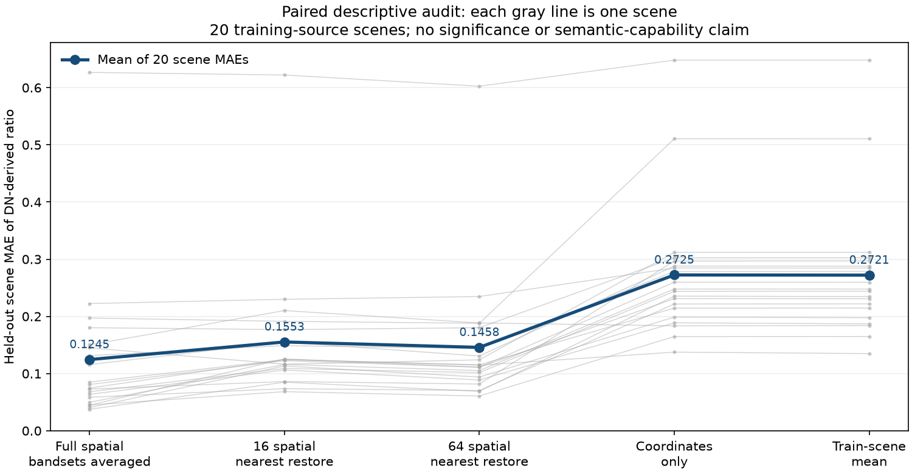

# OE2 문제 재현·수정과 첫 실제 표현 진단

작업은 9/26에 시작해 9/27 KST에 완료했다. **새 VLM의 성능 향상이나 새 사전학습 방법의 우월성을 입증한 결과는 아직 없다.** 이번에는 이전 OE1의 약점을 재현하고, 다음 실험이 같은 문제를 반복하지 않도록 코드와 평가를 보완했다. 원 사전등록·데이터·응답·체크포인트·실행 소스는 변경하지 않았다.

현재 가장 큰 문제는 질문의 정답 편향과 공간 정보 평가의 부재다. OlmoEarth 자체의 사전학습이 잘못됐다고 판단할 증거는 없다. 반면 기존의 16토큰 공간 압축은 실제 센서 신호를 읽는 작은 진단에서 불리했다. 후속 연구의 출발점은 이 손실을 정확히 측정하고 줄이는 것이다.

## 1. 무엇이 문제였고 무엇을 고쳤나

| 문제 | 실제 증거 | 이번 변경 | 남은 한계 |
|---|---|---|---|
| 질문만으로 높은 점수 | train 클래스 다수 답만으로 dev BA 68.36%, frozen과 같은 총점 | train 전용 prior와 동일 질문 양답 층 평가를 구현·실행 | 사후 분석이며 새 독립 평가가 아님 |
| 보조 점수의 다른 동률 규칙 | 1,740개 저장 답 중 75개 exact logit tie; joint real 보조 75% 대 주 72.27% | direct-logit 공통 함수와 수정 trainer 사본 연결, 21개 회귀검사 | 새 trainer를 재학습한 것은 아님; 원 점수 보존 |
| 존재 라벨을 공간 정답으로 확장 불가 | 640개 모두 scene-presence, dense mask 없음 | grid·좌표 단위·mask 출처·label support·정합 검증을 요구하는 측정 계약 | 공간 라벨을 새로 확보하거나 실제 지리 정합을 복구한 것은 아님 |
| 영상 격자 메타데이터 충돌 | 640개 모두 outer 10m 대 nested TIFF 60m, 픽셀 면적비 36 | 잘못된 면적 계산 재현, 검증 전 면적 gold 생성 거부 | 기존에 알려진 불일치의 범위 감사; 원 분류 결과를 무효화하지 않음 |
| 16토큰 압축의 정보 보존 미검증 | 실제 frozen Tiny 20장 센서값 복원: full MAE .1245 대 16토큰 .1553 | 원 공간/16/64토큰, 좌표·평균 기준선을 동일 readout으로 실행 | 단순 DN 비율·선형 판독기 진단이며 VLM/식생 건강 결과 아님 |

원 OE1은 학습된 VLM의 시각 경로를 확장한 것이 아니라, OlmoEarth + 무작위 MLP + 고정된 일반 Olmo3-7B 언어모델을 연결한 실행이다. 512개 train 영상의 yes/no 1,024문항을 두 번 노출하고 첫 답 토큰만 학습했다. 영역·면적·변화·설명 정확성을 배우는 감독은 없었다. 따라서 이 실행으로 사용자가 원하는 공간 설명 능력까지 평가할 수 없다.

## 2. 질문 편향을 빼고 보면 얼마나 남나

원 real 조건의 free-vocabulary 첫 토큰 주지표를 그대로 사용했다. 다수 답 기준선은 train만으로 계산하고, 동률 및 미관측 질문은 no로 고정했다.

| 시스템 | 원 dev 256문항 pooled BA | 같은 질문·클래스에 양답이 있는 26개 층의 평균 BA |
|---|---:|---:|
| train 클래스 다수 답 | 68.36% | 50.00% |
| train 동일 질문 다수 답 | 61.72% | 50.00% |
| 학습된 blind | 66.80% | 50.00% |
| frozen EO + 연결부 | 68.36% | 57.37% |
| joint EO + 연결부 | 72.27% | 66.99% |

오른쪽은 **68문항·58패치·9클래스**로 전체 dev의 26.6%만 포함하며, 층을 동일 가중한다. 왼쪽과 모집단·가중 방식이 다르므로 좌우 수치로 성능 향상을 계산하지 않는다. 26층 중 15층은 문항 2개뿐이다. blind는 178개 질문 그룹에서 같은 질문에 항상 같은 답을 냈다. joint는 같은 질문에 관측에 따라 답을 바꾸는 일부 신호를 보였지만 EO 입력의 취득일 효과까지 분리한 결과는 아니다.

전체 dev에서 joint는 클래스 다수 답 대비 27개를 새로 맞히고 17개를 잃어 순증 10정답이다. frozen 대비도 순증 10개다. 같은 점수인 클래스 기준선과 frozen이 동일한 예측을 했다는 뜻은 아니다. mixed forest와 complex cultivation patterns에서는 joint가 frozen보다 나빴다. 여러 대상에서 일관되게 좋아졌다는 주장은 불가하다.

원 `query_class`도 train 200/1024, dev 52/256문항에서 비어 있다. 분석에서는 **train 질문에 등장하는 target 표현만**으로 19클래스 사전을 구성했고 정답이나 영상 라벨로 target을 추정하지 않았다. 원 metadata를 그대로 쓴 결과, 문구 정규화 결과, 미관측 질문 비율을 따로 보존했다. 원 metadata 자체를 고쳐 덮어쓰지는 않았다.

근거: [질문 편향 감사 메모](../artifacts/oe2_problem_audit_20260927/shortcut/SHORTCUT_AUDIT.md), [전체 수치·지원 수](../artifacts/oe2_problem_audit_20260927/shortcut/shortcut_audit.json), [문항별 비교](../artifacts/oe2_problem_audit_20260927/shortcut/dev_predictions.jsonl).

## 3. 채점 수정은 성능 상승이 아니다

전체 어휘 argmax는 canonical yes/no 동률에서 작은 token ID인 no를 선택한다. 기존 보조 규칙은 `p_yes >= .5`로 yes를 골랐다. 이번에는 확률을 재비교하지 않고 **원 logits를 직접 비교하고 동률에만 token ID 규칙을 적용**한다. 확률 반올림으로 .5가 된 미세 차이도 별도로 검사한다.

저장된 real logits에 새 규칙을 적용하면 frozen/joint/blind의 보조 정답은 175/185/171로 원 주지표와 일치한다. 원 결과를 교체하지 않고 별도 정책 비교로 기록했다. zero 조건의 대문자 Yes/No 및 비응답 토큰 때문에 42행에는 출력 공간 차이가 남는다. 이를 억지로 일치시키지 않는다.

[수정 trainer](../code/oe2_problem_audit_v0/scoring/train_pilot_scoring_v1_1.py)는 보조 선택 함수·policy·SHA 기록만 바꾼 사본이며 기존 launcher를 자동 교체하지 않는다. [공통 채점 함수](../code/oe2_problem_audit_v0/scoring/yes_no_scoring.py), [정책 감사](../code/oe2_problem_audit_v0/scoring/SCORING_AUDIT_README.md), [75개 변경행](../artifacts/oe2_problem_audit_20260927/scoring/historical_tie_audit/changed_secondary_rows.jsonl)을 함께 남겼다.

## 4. 측정으로 확장하기 전에 필요한 데이터 계약

현재 640개 패치는 장면 안에 어떤 토지피복이 존재하는지만 알려준다. “숲이 있다”에서 “숲이 0.4㎢이며 이 위치다”를 만들 수 없다. 부분 영역만 전문가가 판독했다면 나머지를 음성으로 취급해서도 안 된다.

[측정 계약](../code/oe2_problem_audit_v0/measurement/measurement_contract.py)은 공간 mask와 출처, 판독한 범위, 영상과 라벨의 정합 검증, 미터 좌표계 검증 및 일관된 affine을 요구한다. 문자열 `"false"`를 실제 검증 완료로 통과시키지 않으며 비유한 면적·비율도 거부한다. **제공된 검증 기록의 형식을 검사하는 코드이며 mask의 사실성을 독립 검증하는 모델은 아니다.**

640개 모두 면적 gold의 조건을 충족하지 않는다. 특히 60m transform을 120×120 배열에 그대로 쓰면 10m transform 기준보다 36배 큰 면적이 된다. 합성 20×20→120×120 재표본화에서 이를 재현했다. 실제 이미지의 지리 정합을 새로 복원했다는 의미는 아니다. 재표본화 시 transform도 크기에 맞게 조정해야 하는 근거는 [Rasterio 공식 설명](https://rasterio.readthedocs.io/en/stable/topics/resampling.html)에 있다.

근거: [640개 계약 감사](../artifacts/oe2_problem_audit_20260927/measurement_audit.json). 기존 분류용 eligibility와 점수는 유지한다.

## 5. 실제 OlmoEarth 표현 20장 실험

사전에 고른 서로 다른 MGRS의 OE1 train 사례 20개를 그대로 사용했다. 공개 Tiny 가중치·파일/배열 SHA를 확인했고 encoder를 업데이트하지 않았다. CPU 4스레드로 약 12.54초, 준비를 포함한 launcher 약 13.43초에 끝났다. 새 GPU 학습이나 VLM 추론은 없다.

실제 native shape는 `[1,30,30,1,3,192]`다. 세 bandset은 모든 조건에서 동일하게 평균했다. **900개 공간 위치를 유지한 표현**, 4×4로 압축한 16개, 8×8로 압축한 64개를 비교했다. 압축 표현은 nearest 방식으로 30×30에 복원해 같은 D=192 선형 ridge 판독기를 붙였다. 5개 고정 fold마다 16장으로 학습하고 4장의 장면 전체를 평가했다. 표준화는 fold train만 사용하고 alpha=1을 사전에 고정했다.

목표는 raw DN의 `(B08−B04)/(B08+B04)`를 native cell마다 평균한 센서 비율이다. 보정된 물리 NDVI나 식생 건강 gold가 아니다. 구름·의미 영역 mask는 사용하지 않았다.

| 입력 표현 | 장면 평균 MAE ↓ | 장면 평균 MSE ↓ |
|---|---:|---:|
| 원 공간 900위치, bandset 평균 | **0.12450** | **0.03502** |
| 16위치, nearest 복원 | 0.15527 | 0.04538 |
| 64위치, nearest 복원 | 0.14578 | 0.04081 |
| 좌표만 | 0.27245 | 0.09956 |
| train 장면 평균 상수 | 0.27214 | 0.09938 |

원 공간 표현의 MAE는 16/64위치 각각과 비교해 **20장 중 16장**에서 낮았고 train 평균 기준선보다 20장 모두 낮았다. 이 readout에서 공간 압축이 센서 비율의 복원을 악화시킨다는 개발 증거다. 다만 원 표현도 6/20장에서는 장면 내부 R²가 음수다. 전체 장면 평균 R²는 −36.20(중앙값 +0.627)으로, 한 장면의 작은 분산과 큰 예측 편향에 크게 영향을 받는다. 해당 T29UPB 장면의 표준편차는 약 .02346, 예측 편향은 +.62677, R²는 −717.91이다. 불리한 지표와 모든 장면 값을 함께 공개한다.

**이 실험으로 확정하지 않은 것:** pooling의 불가역적 정보 소실, bandset 평균 손실, 기존 QA 오답의 원인, 실제 VLM 개선, 의미 segmentation, 독립 지역 일반화. 작은 선형 판독기와 nearest 복원 자체의 제약이 있고, 20장은 이미 OE1 train에 사용됐다. 단순히 토큰 수를 늘리는 것은 새로운 사전학습 방법이 아니다.

[실행 요약](../artifacts/oe2_problem_audit_20260927/cpu20_v0/probe/summary.json), [장면별 값](../artifacts/oe2_problem_audit_20260927/cpu20_v0/probe/scene_metrics.json), [원본 4장·센서 비율](../artifacts/oe2_problem_audit_20260927/visuals_v0/first4_rgb_and_dn_ratio.png), [실행된 source snapshot](../artifacts/oe2_problem_audit_20260927/cpu20_v0/code_snapshot/signal_probe.py).

## 6. 다음 실험의 변경점과 논문 주장

1. **실제 VLM을 기준선으로 실행한다.** 기존 Qwen3-VL의 RGB 시각 경로를 보존하고 별도 EO 슬롯을 연결한다. RGB-only, 분광 밴드 렌더링, RGB+EO를 같은 데이터·학습 기회로 비교한다. 이번에는 adapter를 구현하거나 학습하지 않았다.
2. **연결부 압축과 encoder 학습 효과를 분리한다.** 첫 공간 감독 진단에서는 encoder를 고정하고 16/64/원 공간 readout을 비교한다. 정보 보존 방법의 본 비교에서는 L/P의 토큰 수·연결부·감독을 같게 둔다. 토큰 증가 효과를 새 사전학습 효과로 세지 않는다.
3. **질문 편향을 평가 전에 통제한다.** 질문/클래스별 양답 지원 수와 지역·계절을 먼저 고정한다. blind·train-only prior·동일 문구 다른 관측을 모두 보고한다. 과거 68문항의 조건부 평가는 최종 test로 승격하지 않는다. 취득일과 픽셀 내용의 기여를 분리하는 대조군도 필요하다.
4. **사람 라벨 예산은 실제 공간 근거에 먼저 쓴다.** 첫 20장으로 영역·측정값·판독 가능 범위·불확실성에 드는 시간을 실측한다. scene-presence QA를 수천 개 늘리기보다 검증된 공간 표본을 먼저 확보한다. AI 간 합의는 정답의 독립성 근거로 삼지 않는다. 기존 100만 원 예산 계획을 유지하며 이번 지출은 0원이다.

TerraScope 대비 “마스크·면적을 답하는 VLM” 자체는 차별점이 되지 않는다. 기존 [선행 비교](OE2_TERRASCOPE_COMPARISON_AND_FIRST_VLM_20260926.md)를 유지하며, 후보 기여는 **같은 관측·공간 감독·토큰 예산에서 OlmoEarth의 표현 학습을 바꾸었을 때 실제 VLM이 필요한 정보를 더 정확하게 읽고, 새 reader에서도 그 이득이 남는가**이다. 아직 이를 구현·입증하지 않았다. 이번 감사는 이 주장을 시험하기 위한 장애물을 좁힌 단계다.

## 7. 파일·검증·전송 상태

- 새 코드: `code/oe2_problem_audit_v0/`의 scoring / shortcut / measurement / probe.
- 원 OE1 1,740응답 주·보조 점수 재현, 원 입력 hash 보존. 채점 회귀 21개, 측정 계약 13개, 질문 감사 합성 9개 통과. probe의 수학·fold selftest와 실제 20장 실행 완료.
- 연구 서버에 전송하고 실행한 것은 별도 경로의 CPU probe와 시각화 코드다. `/home/work/data/olmoearth/oe2_problem_audit_20260927/`에 보존했다. 보호 대상 기존 4개 실행 파일의 해시·mtime 불변을 확인했다.
- 로컬에는 실행 소스 사본·로그·수치·그림을 내려받았다. 원 센서 배열 전체와 모델 가중치는 내려받지 않았다.
- [독립 감사](../artifacts/oe2_problem_audit_20260927/independent_probe_audit.json)는 source·manifest·영수증·5개 분할·100개 장면 점수·집계의 정합을 확인했다. 원 배열/셀별 예측에서 오차를 다시 생성한 범위는 아니다. encoder/VLM은 동결했고, 선형 ridge는 fold train에 실제로 적합했다.
- 첫 4장 RGB와 비율 지도를 육안 확인했다. 일부 선형 경계와 밝은 영역이 비율 지도에서도 보였으나, percentile stretch 영상의 인상으로 숲·도로·구름의 정답을 확정하지 않았다.
- Git commit/push·외부 서비스 게시·OpenRouter 호출·새 VLM 학습은 이번 작업에 포함되지 않는다. 기존 localhost8774 화면도 이번 감사 결과로 변경하지 않았다.

다음 실행의 구체적인 반영 항목은 [v2 실행 순서](../config/oe2_first_vlm_route_v2_20260927.json)에 남겼다. 결과를 보고 원 사전등록의 성공 기준을 바꾸지 않는다.
