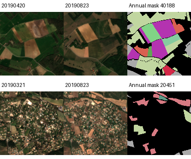

# PASTIS 실제 입력 준비와 실행 상태

2026-09-27. **두 사례의 공학 입력과 독립 검산은 완료했으며, 비교 GPU 학습은 아직 시작하지 않았다.** 64개 학습·16개 개발 후보는 메타데이터 선택까지이며 원 입력 준비 완료 수가 아니다. 연구 확장 설계는 [타 분야·토큰·loop 계획](OLMOEARTH_CROSSDOMAIN_LOOP_PLAN_20260927.md)을 따른다.

## 1. 실제 서버 파일을 검사했다

CPU에서 기존 두 파일 합계39,982,228,803바이트의 SHA256을 순차 검사했다. 감사·두 원사례 추출까지526.68초. GPU와 다운로드는 사용하지 않았다. source shard의 크기·mtime는 검사 전후 동일했다.

| 파일 | 현재 결과 |
|---|---|
| `geobench_pastis.0000.part.tortilla` | 19,990,546,644바이트, 공식 SHA256 `56b1490c…f7ca3` 일치 |
| `geobench_pastis.0001.part.tortilla` | 19,991,682,159바이트, 실제 `3f1e98e3…f1c2e` 대 기대 `7d0463a6…060db` 불일치. 사용하지 않음 |
| `geobench_pastis.0002.part.tortilla` | 없음 |

정상0000의 부분 catalog는911개, 모두 기존 benchmark의 train split이다. 부모 tile별 t31tfm290/t31tfj228/t32ulu211/t30uxv182개다. 완전한 PASTIS 다운로드나 공식 train/val/test 확보로 세지 않는다. [원 감사](../artifacts/oe6_pastis_input_20260927/audit_v0/audit.json).

부분 자료만으로 개발할 수 있는 경로는 확보했다. 손상 파일을 복구하기 전에도 이911개 안에서 지역을 나눈 개발 비교는 가능하다. 전체 benchmark 점수는 완전한 버전·공식 split·전처리 계약을 따로 준비해야 한다.

## 2. 실제 영상·날짜 불일치를 찾아 독립 입력 경로에서 수정했다

설치된 GeoBench PASTIS 로더 SHA256은 `fb61c75d…99f97c`다. `_load_image`는 균등한 인덱스를 사용하지만 `__getitem__`의 날짜 분기는 마지막N개를 사용한다. 원 소스 두 분기를 추출해5-frame fixture에서 실행했을 때 영상은 `[0,2]`, 날짜는 `[3,4]`가 나왔다.

| 원 패치 | 균등2개 선택의 실제 영상 날짜 | 설치 로더가 연결하는 날짜 |
|---|---|---|
| 40188,38관측 | 2018-09-17 / 2019-05-30 | 2019-09-22 / 2019-10-12 |
| 20451,61관측 | 2018-09-17 / 2019-04-20 | 2019-10-17 / 2019-10-27 |

새 준비 경로는 **같은 인덱스를 영상과 원 YYYYMMDD 날짜에 함께 적용**한다. 날짜 길이·순서·중복·요청 관측 수를 검사하고 묵시적 padding을 하지 않는다. 설치 패키지와 과거 실험 입력은 변경하지 않았다. 이 결과는 검사한 버전의 전처리 오류이며 모델 아키텍처 신규성이 아니다.

## 3. 원 영상을 확인하고 두 입력을 완성했다

균등2개 선택의 미리보기에서는 구름이 지표를 가리는 관측이 있었다. 먼저 패치마다8개 날짜를 일정 간격으로 렌더링해 확인했다. 아래 최종 날짜는 assistant의 육안 입력 QA로 선택한 **공학 검사 전용**이며, 전문가의 구름 정답·향후 학습/평가 날짜 선택 정책이 아니다. 원 균등 선택 v1 결과도 보존한다.

| 패치 / 부모 지역 | 최종 확인 날짜 | 원 연간 crop label로 구성한 목표 |
|---|---|---|
| 40188 / t32ulu | 2019-04-20,2019-08-23 | meadow5,005픽셀 |
| 20451 / t31tfj | 2019-03-21,2019-08-23 | winter_durum_wheat1,328픽셀 |

입력은128×128×2×12이며 실제 관측 밴드는10개다. 공식 OlmoEarth PASTIS imputation의 B01←B02/B09←B8A만 사용하고 `band_observed`로10실측/2보완을 표시했다. 이것은 per-band encoder mask를 새로 구현한 것이 아니다. 원 밴드12개를 확보했다고 해석하지 않는다.

GeoBench z-score를 적용하지 않은 raw int16에서 공식 COMPUTED 정규화를1회 적용했다. 실제 `computed.json` hash와 `std_multiplier=2`를 고정하고 별도 코드로 산술을 검산해 두 사례 모두 max delta0. 날짜·밴드 재배열·보완·void(19)·target mask·픽셀 수·region 구분도 검산했다. 최종 선택 입력의 최솟값35/45, 모든 밴드가-10000인 위치0개이며 유한하다. 음수/결측/구름 문제가 모든 원 관측에서 해결됐다는 뜻은 아니다.

정확한 footprint 원 metadata와 cloud mask는 이 패키지에 없으며, centroid·parent tile·동일 pixel grid까지만 연결했다. 면적의 지리적 정확도나 생리/건강/변화시점 정답은 제공하지 않는다. 연간 crop label이 있다고 두 날짜만으로 해당 작물이 판독 가능하다고 보장하지 않는다. [최종 계약](../artifacts/oe6_pastis_input_20260927/prepared_v2/contract.json) · [독립 산술 검산](../artifacts/oe6_pastis_input_20260927/prepared_verification.json).

## 4. 실제 다음 후보80개를 선택했다

원 라벨을 열지 않고 고정 namespace+patch ID의 SHA256 순서로 부모별 후보를 골랐다. 같은 부모 지역은 train/dev에 걸치지 않는다.

| 역할 | 부모 지역 | 선택 수 |
|---|---|---|
| train | t32ulu / t31tfj | 각각32,합계64 |
| development | t31tfm |16 |
| 이번 단계 미개봉 예비 지역 | t30uxv | 원영상/라벨0개 개봉 |

64/16은 **원 입력을 아직 준비하지 않은 메타데이터 후보**다. 예비 지역을 과거 연구·사전학습에서 한 번도 보지 않은 봉인 test라고 단정하지 않는다. 후보 manifest SHA256은 `d0bfc58d…7d1aef0`. [명세](../artifacts/oe6_pastis_input_20260927/development_candidates_v0/selection.json).

다음 실제 실행은 이80개의 입력/라벨과 관측 품질 정책을 준비하고, Qwen 전체 가중치 identity·실제 trainer의 checkpoint 저장복원을 완료하는 것이다. 그 다음 GPU1에서 full-grid/일반 learned resampler 기준선을 학습한다. 한 개발 지역의 결과가 세 지역·여러 분야 일반화를 입증하지 않는다. 여전히 원 OlmoEarth와 공식 목적 추가 학습 비교, 별도 EO 평가, 동일 정보의 구조×학습 대조가 필요하다.

## 5. 이번 추가 구현과 검토

- 원자료→EO 특징→연결부/코드→LLM KV의 캐시 의존성 모듈과10개 단위 테스트를 작성·통과했다. 전체 temporal window와 가중치·prefix·위치 변화의 무효화, 학습 gradient 차단 방지, 근사 cache 거부를 검사한다. **실제 Qwen 수치 일치/속도 측정은 아니다.** [코드 설명](../code/oe6_cache_contract/README.md).
- 로봇/세계모델/라벨링, tokenizer/streaming, 물리/재난을 세 에이전트가 병렬 검토했다. 변환 코드에 대해 별도 출처 연결·날짜 분기·정규화 상수·라벨 검사 리뷰를 반영했다.
- 감사v0의 `complete_dataset_verified` 판정은 stable flag까지 포함하도록 후속v1 코드에서 보강했다. 이번 원결과는0001불일치·0002누락 때문에 어느 판정식에서도false다.40GB 검사를 다시 실행해 성과를 중복 계산하지 않았다.
- 분석/준비 코드는 서버 새 경로에 전송했고 기존 보호 source4개 hash/mtime/size는 마지막 전송 뒤에도 동일했다. 모든 이번 CPU 작업은 종료했다. 새 GPU 학습·유료 API·추가 dataset 다운로드 없음. 원자료/최종 입력은 서버와 로컬에 보존했고 모델 가중치 산출은 없다.
