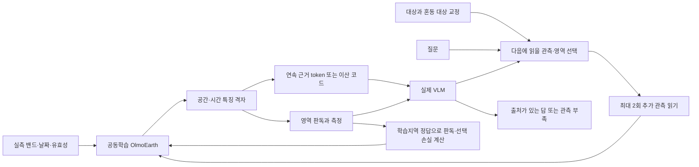

# OlmoEarth가 필요한 관측과 교정을 다시 읽는 VLM으로 확장하는 계획

2026-09-27. 사용자 요청에 따른 설계 v5. [v4의 실제 입력·동일 정보 비교](OLMOEARTH_VLM_ARCHITECTURE_DATA_PLAN_20260927.md)를 유지하면서 로봇, 영상 표현 학습, 시각 tokenizer, 대화형 분할, 물리 모델의 메커니즘을 추가 검토했다. **설계 제안이며 아래 새 모델들의 성능을 측정한 결과가 아니다.** 현재 실행 결과는 [PASTIS 입력 준비 기록](OE6_PASTIS_INPUT_PROGRESS_20260927.md)에 따로 기록한다.

## 1. 커진 연구 문제와 방법 후보

목표는 사용자의 대상 정의와 소수의 교정을 받아, 복잡한 EO 관측에서 필요한 영역·시점을 찾아 읽고, 새 환경에서도 판독 기준을 재사용하는 OlmoEarth VLM이다. 답을 생성한 뒤 실제 근거가 부족하면 다른 관측을 읽거나 확인할 영역을 요청할 수 있게 한다. 중요한 변화는 **OlmoEarth가 이런 선택과 판독에 유용한 특징을 학습하는 것**이다. 도구를 붙인 데모와 encoder 단독 분류 모두 전체 목표의 일부다.

검증할 방법 후보는 **교정으로 드러난 혼동을 해소하는 관측을 선택하고, 그 구별이 압축 표현에 남도록 공동학습하는 방식**이다. 예를 들어 특정 작물 쌍을 구별하기 어려울 때 실제로 존재하는 다른 날짜/필지를 추가로 읽고, 그 관측이 구분을 얼마나 바꿨는지 학습한다. 선택기의 정답은 학습지역의 분리된 공개 mask와 교정 전후 오류에서 계산한다. 평가 정답은 선택에 사용하지 않는다.

지역 맥락·물리 진단은 어떤 관측/교정이 도움이 될지 보조하는 입력이다. VLM 답변은 선택된 원 관측·영역과 연결한다. 이 전체 조합이 새롭거나 필요하다는 것은 아직 가설이다. 일반적인 관측 선택, prototype 학습, 교정/도구 루프, 언어 정렬로 설명되는 효과는 해당 기법의 적용으로 보고한다.

추가 관측은 이미 확보된 실제 관측 후보에서 고른다. unavailable 날짜는 생성해서 실측처럼 사용하지 않는다. 초기 두 번의 추가 읽기는 개발 비용 상한이며 아직 동결된 실험 recipe가 아니다.

## 2. 다른 분야에서 가져올 구체적인 메커니즘

| 출처 | 가져올 내용 | 첫 실험에서 확인할 것 |
|---|---|---|
| [V-JEPA 2.1](https://arxiv.org/html/2603.14482v1) | 세밀한 위치별 표현과 전체 장면 이해를 함께 보존하는 dense·중간층 감독 | 언어/영역 학습 후 독립 EO 성능이 유지되는가. 공식 OlmoEarth 목적과 중복되는 loss는 추가 기여로 세지 않음 |
| [Knowledge Insulation](https://arxiv.org/html/2505.23705v1) | 새 모듈에서 올라오는 gradient와 pretrained backbone 학습 경로 분리 | 전체 joint, head warmup 후 joint, 특정 head gradient 차단을 같은 예산으로 비교. OlmoEarth 전체 동결과 구분 |
| [SAM 3](https://arxiv.org/html/2511.16719v1) | 예시·양성/음성 교정, 존재/위치 판독, MLLM의 제안·검사 도구 루프 | 같은 dense head를 호출하는 일반 Qwen 도구 루프보다 학습 selector가 나은가 |
| [RECAP](https://arxiv.org/html/2511.14759v1) | 실제 결과와 전문가 개입으로 다음 정책을 학습 | 공개 라벨로 계산한 교정/관측 utility를 사용. 단순 utility 회귀를 RL이라고 부르지 않음 |
| [TerraMind](https://arxiv.org/html/2504.11171v3), [UniTok](https://arxiv.org/html/2502.20321v3), [FAST](https://arxiv.org/html/2501.09747v1) | 이산 표현과 텍스트·원영상 경로, 다중 codebook, task에 유효한 압축 | 같은 context 위치 수와 같은 저장 byte를 별도 비교. 순서·위치·물리 크기 보존 여부 |
| [StreamKV](https://arxiv.org/html/2511.07278v1) | 관측 묶음의 검색·KV 압축 | 정확한 재사용부터 검증한 뒤 제한 기억의 근거 보존/비용을 평가 |
| [PROSAIL](https://jbferet.gitlab.io/prosail/articles/prosail-hybrid_inversion.html), [ANUGA](https://github.com/anuga-community/anuga_core) | 식생 분광/홍수 상태의 물리적 가능 범위 | 물리 요약이 같은 원 입력을 받은 일반 분광·지형 모델보다 도움이 되는가 |

SAM 3 가중치는 접근 승인이 필요하고, RECAP 공식 모델은 확인한 openpi 공개 목록에 없다. Phaedra/StreamMem의 코드 이용 가능성도 이번 조사에서 확정하지 않았다. 논문이 있다는 것과 재현 가능한 비교 모델을 확보한 것은 구분한다. DreamGen식 생성 자료는 원리 검토까지이며, 합성 영상으로 실제 분광·수리학 정답을 만들지 않는다. 전체 원 검토: [로봇·학습 루프](../artifacts/oe6_crossdomain_20260927/robotics_loops.md), [토큰·메모리](../artifacts/oe6_crossdomain_20260927/tokens_memory.md), [물리·재난](../artifacts/oe6_crossdomain_20260927/physics_disaster.md).

## 3. '지구 단어'를 구체적으로 정의한다

문자 그대로의 bag-of-words는 공간과 순서를 잃는다. 지역의 거친 검색 대조로는 쓸 수 있지만 위치·시점 근거를 답하는 주 표현으로는 부족하다. 첫 후보는 **원 위치·날짜·센서·유효성을 가진 코드 열**이다.

- **연속 경로:** OlmoEarth 격자 → 충분히 학습한 resampler → 현재 VLM 입력 embedding.
- **이산 경로:** 같은 격자 → VQ/FSQ 등의 코드 → 학습 embedding table → 동일 VLM 입력 위치.
- **물리 크기 보존 후보:** 형태 code와 크기/잔차를 따로 표현한다. [Phaedra](https://arxiv.org/html/2602.03915v1)가 가까운 선행이므로 방식 자체의 신규성을 주장하지 않는다.

`code 417`은 원래부터 '벼'라는 단어가 아니다. 코드와 사람 개념은 별도로 검증해야 한다. 첫 실험에서는 Qwen의 텍스트 tokenizer 전체를 바꾸지 않고 EO 전용 embedding table로 연결한다. EO code 생성까지 확장할 때만 입력/출력 vocabulary 행과 decoding 제약을 추가하고, 새 행의 학습·저장복원·텍스트 능력을 검사한다.

**T1 비교:** 실제 공개 라벨이 준비된 후 고정 OlmoEarth 특징에서 continuous resampler, 일반 VQ/FSQ, residual/product code를 비교한다. fit/tuning은 학습지역만 사용한다. M=16/64/128 reader 위치별 품질과 실제 저장량별 품질을 별도 곡선으로 낸다. codebook·메타데이터·잔차·복원 비용을 포함한다. 이산 코드도 LLM 내부에서는 dense vector/KV가 되므로 디스크 압축률을 KV 절감률로 보고하지 않는다.

주 지표는 작물 영역 IoU·혼동 오탐·교정 검색의 일관성이다. reconstruction은 보조 진단이다. 위치를 바꿔도 code histogram은 같은 사례, 코드 ID와 embedding table의 동시 순열, 결측과 실제0 구분, 새 지역 rare-class code 충돌을 검사한다. 이후 encoder 공동학습까지 개선이 남아야 OlmoEarth 자체의 이득을 주장할 수 있다.

## 4. KV cache와 EO 기억을 분리한다

원자료 cache, EO 특징 cache, 연결부/코드 cache, LLM KV cache는 재사용 조건이 다르다. encoder나 adapter가 업데이트되면 그 뒤 cache는 다시 계산한다. 특히 **OlmoEarth가 여러 날짜를 함께 읽으면, 새 날짜를 추가한 것만으로 기존 날짜 특징도 달라질 수 있다.** 가중치 고정만으로 날짜별 append가 정확해지는 것은 아니다.

캐시 키에는 입력 hash·crop·전처리·밴드/validity·전체 관측 window·encoder/adapter/codebook revision·reader·정밀도·원 causal prefix·위치/attention mask를 포함한다. prefix 뒤의 새 질문은 앞부분 재사용이 가능할 수 있지만, 질문이 조건부 resampler나 앞쪽 prompt를 바꾸면 해당 단계부터 무효화한다.

**M1 비교:** FP32의 동일 입력 전체 재계산 / EO 특징만 재사용 / 불변 prefix KV 재사용을 실제 Qwen에서 비교한다. logit·top1·근거 출력 일치가 먼저이며 latency는 이후다. 이번에 작성하는 캐시 의존성 검사는 이 실제 수치 검증을 대신하지 않는다. 학습 중 frozen Qwen도 입력 gradient가 필요하므로 `no_grad`를 무조건 적용하지 않는다.

정확한 재사용은 실행 효율이다. 제한 기억을 새 연구 주장으로 추가하려면 recency/uniform/일반 salience/StreamKV류와 같은 전체 byte·갱신 비용에서 오래된 근거와 희귀 대상 보존이 좋아야 한다. CPU·디스크 archive를 숨기고 GPU KV만 제한해서 '제한 기억'이라 부르지 않는다. 과거 SN7 기억 병목 철회를 번복한 것이 아니다.

## 5. 실험할 loop와 학습 방식

| 종류 | 바뀌는 것 | 초기 실험 |
|---|---|---|
| 근거 선택 loop | 가중치는 고정, 읽는 실제 관측/영역 변경 | 단발, 균등 선택, uncertainty greedy, 일반 Qwen 도구 루프, 학습 selector 비교 |
| 교정 loop | 검수 자료와 다음 학습 모델 변경 | 기존20개 시간 측정 pilot에서 random/uncertainty/혼동 기준 선택 비교 |
| streaming update | 새 관측 도착과 상태 추정 | 관측이 실제로 들어온 순서·가용성 고정. 처음부터 미래 자료를 본 선택과 구분 |
| RL loop | outcome reward로 정책 업데이트 | 위 세 실험에서 선택 문제와 reward가 성립한 뒤 별도 추진 |

**L1의 결정 대조:** 반복 selector가 고른 최종 근거 집합을 단발 reader에도 그대로 준다. 차이가 사라지면 효과는 정보 선택에 있고 반복 언어 추론에 있지 않다. 같은 원 자료 접근권과 총 읽은 픽셀·관측·token·GPU시간에서 비교하고, 추가 읽기 후 정답이 오답으로 바뀌는 비율도 보고한다. 모델의 자기 확신/AI 합의는 reward가 아니다.

**G1의 결정 대조:** 같은 초기 checkpoint·라벨·공식 replay로 full joint / head warmup 후 joint / 새 dense head gradient만 차단하는 군을 비교한다. 언어 및 native 경로는 OlmoEarth를 계속 업데이트한다. gradient cosine은 오류 원인 진단이며 성공 지표가 아니다. 독립 EO 성능, 실제 dense 판독, 같은 dense 출력을 받은 VLM을 함께 평가한다. 중간층 감독은 이 비교 뒤 공식 목적과 중복을 감사하고 한 축씩 추가한다.

최소 학습 목적의 시작점은 `공통 native loss + 영역/질의 loss`다. 그 다음 실제 오류에 따라 **교정으로 필요한 구분을 남기는 표현 감독** 또는 **추가 관측의 utility 감독** 중 하나만 붙인다. 두 감독을 동시에 켜기 전 각각의 일반 대조가 있어야 한다. 결과를 본 개발 선택은 개발로 기록하고 봉인 평가의 기준을 나중에 바꾸지 않는다.

## 6. 물리는 조건을 확인한 뒤 붙인다

가장 작은 후보는 PROSAIL로 만든 LUT와 실제 밴드 반사도의 적합 오차·후보 모호성이다. 최대4,096개의 작은 CPU LUT는 실행 제안이며 아직 생성하지 않았다. 이것이 교정 전이를 예측하는지 일반 분광 거리, 같은 크기 비물리 재구성 모델과 비교한다. 실제 센서 반응함수·반사도 scale·관측 기하가 필요하다. 없는 각도는 실제값으로 넣지 않고 가정 범위에 대한 민감도를 본다. PASTIS 작물 라벨은 LAI·수분 스트레스 정답이 아니다.

ANUGA가 출력하는 수심/범위는 SAR 영상이 아니다. 수리학→산란 관측 연산자와 유역 강제력이 없으면 합성 SAR 감독으로 사용할 수 없다. Kuro의 실제 SAR에 수리 prior를 추가하는 후속 비교도 같은 DEM·강우/유량을 받는 일반 모델이 필요하다. 물리법칙을 임의 embedding에 직접 적용하지 않는다.

## 7. 실행 우선순위와 완료 기준

1. **입력 준비를 실제 수행:** 기존 PASTIS hash 검사, 검증된 shard의 최대2사례, 영상/날짜 공동 인덱스, 밴드 보완 출처·mask·parent tile·원 라벨 확인. 손상 shard는 사용하지 않는다. 설치 로더의 날짜 불일치를 독립 재현하고 보존한다.
2. **학습 가능한 일반 기준선:** 실제 train/dev parent 분리와 Qwen checkpoint 저장복원, native 목적 대조, full-grid/learned resampler 비교. 첫2사례의 연결 성공을 일반화 결과로 보고하지 않는다.
3. **우선 연구축은 G1과 L1:** 학습 경로가 EO 표현에 주는 효과와, 필요한 관측을 선택하는 효과를 분리한다. 두 축이 올바른 방향일 때 교정 전이2×2로 결합한다.
4. **T1과 M1은 독립된 작은 실험:** 토큰화의 품질–저장량 비교, 실제 캐시 수치 검증. 캐시 의존성 코드와 테스트부터 작성하되 모델 검증 통과로 세지 않는다.
5. **물리/사람 loop:** 실제 입력 계약이 충족된 PROSAIL 진단과 기존100만원 검수 pilot에 붙인다. 시뮬레이터·새 vocabulary·RL을 한꺼번에 본 학습에 넣지 않는다.

이 프로그램에서 강한 결과는, 새 지역의 적은 교정으로 어려운 대상을 잘 찾는 것과 동시에 **왜 어떤 추가 관측이 도움이 되는지, 어떤 표현·학습 경로가 그 구별을 보존하는지**가 대조 실험으로 설명되는 것이다. 데이터량·모듈 수만으로 대신하지 않는다. 학습과 자료 확보의 실제 완료 범위는 실행 기록에서 갱신한다.
