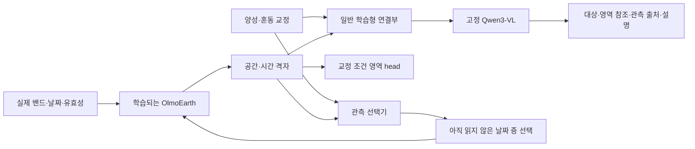

# OlmoEarth 교정 전이 연구: 다음 실험 설계 v6

2026-09-27. 상태: **개발 실험 설계. 본 평가 사전등록이나 학습 완료 보고가 아니다.**

현재 방법의 우월성과 신규성은 입증되지 않았다. 실제 완료 범위는 [OE6 기록](OE6_PASTIS_INPUT_PROGRESS_20260927.md), 이전의 넓은 아이디어와 선행 검토는 [v5](OLMOEARTH_CROSSDOMAIN_LOOP_PLAN_20260927.md)에 보존한다. 이번 문서는 다음 비교의 순서·정보 접근권·비용·판정 기준을 구체화한다. 과거 사전등록과 실패 판정은 변경하지 않는다.

**1. 무엇을 논문 기여로 만들 것인가**

목표는 전문가가 알려준 대상과 혼동 대상의 구별을 다른 환경에 재사용하는 OlmoEarth 기반 VLM이다. 예를 들어 원래 수역과 새 침수를 교정했을 때, 새 지역에서도 과거 관측을 이용해 둘을 구별하고 위치와 근거를 답하게 한다. 논문에서는 다음 주장을 각각 검증한다.

| 주장 | 필요한 결과 | 충분하지 않은 결과 |
|---|---|---|
| 적은 교정으로 새 지역에 적응한다 | 같은 자료·교정 예산에서 지역 밖 성능/실제 판독 시간 개선 | 공개 mask로 만든 예시를 사람 교정이라고 부르기 |
| 관측을 더 잘 활용한다 | 같은 관측 접근권과 실제 계산 비용에서 선택의 이점 | 선택기가 모든 영상 embedding을 공짜로 보고 날짜 고르기 |
| OlmoEarth에 이점이 남는다 | 원본/공식 목적 추가 학습/일반 공동학습 대비 독립 EO 평가와 새 reader 재사용 | 한 VLM의 연결부만 좋아진 결과 |
| 새 방법이 필요하다 | 같은 감독의 일반 contrastive·distillation·selector보다 재현 가능한 이점 | 기존 모듈을 많이 결합했다는 설명 |

첫 실행은 최종 방법의 우월성을 증명하는 실험이 아니라, 이 주장을 지탱할 현상이 실제로 존재하는지 확인하는 개발 비교다. 일반적인 방법으로 충분히 해결되면 그 결과를 받아들이고 새 원리 주장을 보류한다.

**2. 현재 출발점과 남은 일**

| 항목 | 확인된 상태 | 다음 산출물 |
|---|---|---|
| 실제 모델 연결 | OlmoEarth v1.2 Base→Qwen3-VL-8B FP32에서 언어 손실의 encoder 역전파 확인 | 실제 영역 정답 학습과 전체 trainer 저장·복원 |
| PASTIS 입력 | 원 사례 2개, 날짜 대응 수정, 정규화 독립 검산, 육안 QA | manifest 기반 80개 extractor와 episode builder |
| 개발 후보 | train 64 / dev 16 메타데이터만 선택 | 원 배열·라벨·유효성·관측 목록 준비 |
| 자료 무결성 | 정상 shard의 train 911행. 다른 shard 1개 불일치, 1개 누락 | 부분 자료 개발과 완전한 공식 평가를 별도로 관리 |
| 제안 방법 | 교정 전이 episode 학습 0개 | 강한 기준선 이후 2×2 비교 |
| 캐시 | 의존성 단위 검사 10개 통과 | 실제 모델의 수치 동등성·지연 검증은 후속 |

현재 2사례 preparer는 감사 첫 두 사례를 읽고 큰 작물 영역을 고르는 공학 검사다. 이를 그대로 대량 학습 생성기로 쓰지 않는다. 32×32·2날짜의 이전 연결 검사와 128×128 원 패치 학습은 메모리 규모가 다르다. 공간 patch=4이고 날짜별 격자를 유지하면 128×128·2날짜에서 공간·시간 token은 2,048개가 될 수 있다. 실제 출력 shape를 측정한 뒤 full-grid 경로를 실행한다.

**3. 데이터와 문제를 두 단계로 나눈다**

**PASTIS: 첫 학습·전이 검증.** 작물 예시를 받고 다른 패치에서 같은 작물의 영역을 찾되, 지정한 혼동 작물을 배제한다. 공개 label로 합성 support를 만들 수 있어 사람 비용 없이 학습 구조를 먼저 검증할 수 있다. 연간 작물 mask는 고사·질병·생리 상태·변화 발생일의 정답이 아니다. 공식 PASTIS는 프랑스 작물 시계열과 5-fold 평가를 제공한다. 현재 부분 자료의 자체 지역 분할 점수를 공식 benchmark 점수로 부르지 않는다. [공식 자료](https://github.com/VSainteuf/pastis-benchmark).

**Kuro Siwo: 사건 간 전이 확장.** 새 침수/기존 수역/비수역의 구별을 검증한다. 원 자료는 사건 전 2회·후 1회 SAR와 전문가 mask를 제공한다. PASTIS의 8후보·4관측 설정을 억지로 적용하지 않고, 현재 관측에서 시작해 최대 두 과거 관측을 추가한다. 과거 연구에서 본 사건은 개발 자료로만 사용하고, 신규 평가 사건의 노출 이력을 먼저 감사한다. 기존 파생 캐시의 합성 날짜나 잘못 연결된 날짜를 재사용하지 않는다. [공식 데이터 카드](https://huggingface.co/datasets/orion-ai-lab/Kuro-Siwo-Webdataset).

본 논문의 일반화는 최소한 서로 다른 지역의 반복과 다른 EO 문제에서 확인하는 것을 목표로 한다. 확보하지 않은 국가·연도·새 개념의 전이를 이미 가능한 평가로 적지 않는다. 고사목·해양 쓰레기·기후 원인은 센서 해상도와 실제 정답을 확보한 후 별도 확장한다.

**4. 하나의 평가 episode를 정확히 정의한다**

- 질문: “양성 예시와 같은 대상을 찾되, 이 혼동 예시는 제외해줘.” 질문 조건과 양성·음성의 역할을 모든 모델에 동일하게 제공한다.
- support: 정답을 공개하는 교정용 패치/영역. query: 모델이 답해야 하는 별도 패치. 같은 패치·같은 필지·겹치는 crop을 양쪽에 배치하지 않는다. 인접·중복 여부가 불확실하면 분리 보장 범위를 보고하고 본 평가를 보류한다.
- 교정 한 단위: **양성 영역 1개와 혼동 영역 1개의 쌍**. 클릭 한 번과 같지 않다. 사람이 읽고 찾고 표시하고 확인한 전체 시간을 별도 기록한다. 공개 mask에서 생성한 쌍은 synthetic support로 명시한다.
- 개발 예산: K=1,2,4,8쌍. 같은 support 순서의 중첩 prefix를 모든 비교군이 받는다. 예전 1/5/20 계획과 다른 새 개발 설정이며 과거 기록을 덮어쓰지 않는다.
- K=0: 대상 이름/정의가 주어지는 별도 named-target 조건에서만 정의한다. 이름 없는 새 예시 대상의 K=0 성능을 0점으로 채워 곡선을 만들지 않는다.
- source-support 전이와 target-support 적응을 분리한다. 전자는 학습 지역에서 만든 동일 support를 새 지역 query에 재사용한다. 후자는 새 지역의 별도 support 영역을 K만큼 공개한다. 후자의 비용에는 새 지역 교정 시간이 들어가며 완전한 무라벨 전이라고 부르지 않는다.
- 고정 support replay를 주 비교로 둔다. 모델마다 다른 교정을 요청하는 active-labeling 정책은 같은 총 시간 아래의 후속 비교다.
- source-support 평가 bank도 학습 부모 안에서 객체/패치 단위로 episode 학습과 분리한다. 64개 후보 내부의 역할과 실제 쌍 수는 raw 감사 후 결과를 보기 전에 고정한다. 그 bank의 정답은 encoder의 supervised 학습에 쓰지 않는다. 이미 학습한 exemplar를 재사용하는 조건은 별도 표시하며 새 교정에 대한 전이와 섞지 않는다.
- 주 평가에서 모델 가중치는 고정한다. 새 지역의 gradient 적응은 별도 실험으로, support만 이용해 같은 update 예산을 준다. query mask는 scoring 프로세스만 읽는다.

개발 후보 64개는 t32ulu/t31tfj 각32, dev16은 t31tfm이다. dev 지역에서 support/query가 모두 필요하면 먼저 공간 블록/필지 단위로 분할하고, 유효 episode 수를 보고한다. 16개에서 모든 작물·K를 만족한다고 가정하지 않는다. 부족하면 결과를 보기 전에 같은 부모의 다음 hash 순위로 후보를 확장하고 manifest revision과 이유를 남긴다. t30uxv는 이번 단계에서 열지 않은 예비 지역일 뿐, 역사적 노출 감사 전에는 봉인 test가 아니다.

새 지역 평가와 새 클래스 평가는 다르다. 작물 class를 학습에서 이미 봤다면 “새 지역의 알려진 작물”이다. 새 클래스 주장은 class-disjoint training을 별도로 구성한 뒤 한다. 전체 pretraining의 미노출을 보장할 수 없으면 그 한계도 명시한다.

**5. 입력과 출력, 학습 경로**

출력 계약은 target/ref IDs, mask 또는 mask 참조, 선택한 관측 IDs, 알려진 pixel grid의 면적 비율, 짧은 설명이다. 초기 면적은 유효 pixel 분모를 명시한 비율로 채점한다. 정확한 footprint가 없는 자료에서 검증된 지리 면적이라고 주장하지 않는다. 관측 IDs가 유효하다는 것만으로 그 날짜가 답을 증명한다고 채점하지 않는다.

영역 head를 가진 specialist+측정 연산+같은 Qwen도 반드시 비교한다. VLM이 동일한 mask를 문장으로 읽기만 한다면 그 효과는 영역 판독 개선으로 보고한다. VLM 기여는 대상/혼동 역할 전환, 새로운 표현의 질문, 다중 영역 참조, 날짜 조건 해석에서 별도 확인한다. mask·그 mask의 면적·설명을 독립된 세 가지 능력 개선으로 중복 계산하지 않는다.

귀속 실험에서는 하나의 저장된 predicted mask/count/provenance 묶음을 모든 reader에 동일하게 제공한다. 같은 Qwen만 쓰고 서로 다른 mask를 주는 end-to-end 비교와 구분한다. U-TAE의 원래 named-class 출력은 이름 없는 exemplar 질의를 직접 지원하지 않을 수 있다. 같은 support prototype/binding head를 학습시키거나 비교를 named-target 범위로 제한한다. 미지원 인터페이스를 오답0점으로 처리해서 VLM의 필요성을 만들지 않는다.

첫 모델은 OlmoEarth와 연결부/영역 head를 학습하고 Qwen 가중치를 고정한다. Qwen의 입력 gradient는 유지한다. 실제 비교의 checkpoint·전처리·trainable parameter 목록을 고정하며, BF16은 기존 캐시 문제를 해결한 것으로 간주하지 않는다. 첫 정합성 기준은 FP32/no-cache이고 BF16 학습은 별도 수치·gradient·저장복원 검증 뒤 결정한다.

**6. 강한 기준선과 최소 비교 행렬**

먼저 충분히 학습한 일반 모델을 만든다. 기존 16개 평균 token 경로 하나를 주 상대 모델로 사용하지 않는다.

| ID | 학습/판독 | 역할 |
|---|---|---|
| B0 | 원본 OlmoEarth 고정 + 학습형 연결부/영역 head | 표현을 바꾸지 않았을 때의 기준 |
| B1 | 공식 EO 목적만 추가 학습한 OlmoEarth + B0와 같은 downstream 학습 | 추가 EO 자료/계산 자체의 이점 확인 |
| B2 | 일반 공동학습: native replay + 영역/질의 감독 | 제안 방법의 주요 상대 |
| B3 | 시계열 전문 모델(U-TAE 등) + 측정 도구 + 같은 Qwen | VLM/OlmoEarth 조합의 필요성 확인 |
| B4 | B2 + 같은 교정 쌍의 표준 supervised contrastive/일반 distillation | 특수한 새 학습 규칙의 필요성 확인 |

공식 목적 B1은 감독 정보가 적어 제안 방법의 유일한 novelty 대조가 될 수 없다. 공정한 방법 비교는 같은 이미지·support·영역 정답·replay·VLM을 받은 B2/B4가 담당한다. B1에도 해당 pretraining 단계에서 같은 허용 원영상 집합을 노출하고 모달리티/target 부족을 명시한다. 원 optimizer 없이 공개 weights로 시작한 학습은 원 학습의 정확한 resume가 아니다.

[U-TAE 공식 구현](https://github.com/VSainteuf/utae-paps)은 공개 benchmark의 전문 시계열 비교 후보다. 입력·라벨·관측 수를 맞춘 재학습 결과와 외부 논문의 점수는 구분한다.

2×2는 **표현 학습과 관측 선택**을 분리하는 최소 개발 비교다. 양쪽 축 모두 처음부터 신규 방법이라고 부르지 않는다.

|  | S0: 고정 관측 순서 | S1: 학습한 관측 선택 |
|---|---|---|
| R0: 일반 공동학습 B2 | M00 | M01 |
| R1: 교정의 구별을 보존하는 학습 후보 | M10 | M11 |

R0/R1은 같은 크기의 encoder·연결부·head와 같은 교정 쌍을 사용한다. R1의 첫 구현은 target/혼동 영역을 구분하는 episodic pair 감독으로 시작할 수 있으나, 이는 학습 가설의 대조이고 표준 contrastive와 같으면 새 알고리즘이 아니다. 일반 contrastive를 넘어서는 구체적인 보존 규칙은 오류 진단과 B4 비교 후 별도 명세로 동결한다. 현재 새 목적함수의 신규성이 이미 확보됐다고 주장하지 않는다.

공통 목적은 `L_native + λ_mask L_mask + λ_query L_query`. 개발에서 검토할 R1은 여기에 `λ_pair L_pair`를 추가한다. 모든 λ, train/dev 샘플링, 부가 head, warmup과 LR 탐색 수는 비교군별 장부에 기록한다. full joint / head warmup / 새 head gradient 차단은 이전 G1 설계의 진단으로 유지하되, 네 칸의 주 비교에 여러 recipe를 몰래 섞지 않는다.

첫 R1 구현 후보를 구체적으로 쓰면, 양성/혼동 support의 정규화 특징 평균을 `p+ / p−`, query의 유효 공간 특징을 `u`, 두 대상의 정답 부호를 `y=+1/−1`로 두고 `d(u)=cos(u,p+)−cos(u,p−)`, `L_pair=mean softplus((m−y*d(u))/τ)`를 사용한다. m=0.2, τ=0.1, λ_pair=0.1은 검증 전 개발 시작값이다. 공통 mask loss는 유효 pixel BCE+Dice, query loss는 같은 출처 기반 구조화 답의 CE로 시작한다. 이 pair loss는 알려진 metric learning 계열이다. B4와 같은 계산이 되면 한 조건으로 통합하고 서로 다른 신방법처럼 비교하지 않는다. 일반 pair 학습이 통한다는 결과는 본 방법 개발의 출발점이다.

격자 경계의 혼합 cell은 원 mask 비율을 평균해서 soft weight로 반영하고 categorical mask를 bilinear 보간하지 않는다. 연간 crop label을 각 날짜의 crop 상태 정답으로 반복하지 않고, 선택된 관측 window의 pooled 공간 표현에 pair loss를 적용한다. 기존 이미지뿐 아니라 공개 정답에서 정한 비교 class도 사람 검수 전에는 실제로 시각적 혼동이 큰 class라고 단정하지 않는다.

후속 방법 후보는 교정이 정의한 target/혼동 구별이 dense 격자에서 압축 token 경로로 전달될 때 유지되도록 감독하는 것이다. 같은 head를 양쪽 경로에 두고 source-aligned 점수 차이를 보존할 수 있지만, 일반 feature/mask distillation, 더 큰 resampler, 동일 정보의 dense branch와 비교해야 한다. 잘못된 teacher를 모방하거나 dense output이 압축 경로를 우회하는 문제를 검사한 뒤 수식을 고정한다. 이 후보의 효과와 신규성은 지금 미확정이다.

첫 2×2에서는 R0/R1을 **동일한 날짜 subset 일정**으로 학습하고 최종 가중치를 고정한 뒤 두 관측 정책으로 평가한다. 네 칸은 반드시 네 번의 독립 encoder 학습을 의미하지 않는다. 공통 train utility로 학습한 selector를 두 표현에 동일하게 적용하되 입력 projection·상태 표본 수·학습 예산을 맞춘다. 실제로 encoder별 selector를 따로 학습하면 그 차이를 기록한 부차적 시스템 비교로 분리한다. 개발 source 2지역만으로 utility의 환경 전이까지 보장하지 않는다.

2×2 이후 M11−M00뿐 아니라 M10−M00, M01−M00 및 상호작용 `(M11−M10)−(M01−M00)`을 보고한다. 결합 이득만으로 새로운 원리를 증명하지 않는다. 같은 utility 정답을 받은 일반 selector와 비교해야 선택 구조의 기여를 주장할 수 있다.

**7. 관측 선택과 비용: 공짜 정보가 없게 설계한다**

PASTIS 개발 기본안은 날짜 metadata만으로 고른 최대8개 균등 후보, 사전 고정한 2개 초기 관측, 최대2회 추가 읽기다. 정확한 인덱스/유효성 정책은 raw80 감사 후 모델 결과를 보기 전에 manifest에 고정한다. 후보가 적으면 padding 대신 실제 수와 평가 가능성을 기록한다. 손상·nonfinite와 구름/희미한 지표를 구분하고, cloud 정답이 없는 상태에서 자동 cloud 제거가 완성됐다고 부르지 않는다. 모델 결과를 보고 유리한 날짜만 육안으로 고르지 않는다.

선택기가 볼 수 있는 것은 이미 읽은 영상의 특징, 교정, 질문, 후보 날짜·센서·제공된 품질 metadata다. 미개봉 후보의 EO embedding·RGB thumbnail을 보는 경우 그 생성과 판독을 모두 관측/계산 비용에 더한다. 기본안에서는 제공하지 않는다. 위치·환경 metadata도 모든 군에 동일하게 준다.

학습 utility는 train에서만 `현재 오류 − 후보 추가 후 오류 − 사전 정의 비용 패널티`로 계산할 수 있다. target query gold를 selector 입력이나 평가 보상으로 주지 않는다. 교차 적합한 teacher와 지리 단위 분리로 utility를 만들고, 후보 전수 시험의 추가 forward 비용도 학습 총량에 포함한다. 평가 때는 가중치 고정 상태에서 실제 사용 가능 후보만 고른다.

비교는 고정/균등 순서, metadata 기반 선택, 충분히 학습한 일반 selector, 같은 도구의 일반 Qwen loop를 포함한다. uncertainty 기준이 모든 후보 영상의 예측을 먼저 요구한다면 그 관측 수를 숨기지 않는다. 선택된 최종 관측을 단발 reader에 그대로 주는 replay 대조로 선택의 효과와 반복 추론의 효과를 분리한다.

OlmoEarth가 전체 temporal window를 함께 인코딩하면 2→3→4장의 추가 읽기에서 이미 읽은 영상도 재계산될 수 있다. distinct 관측4장과 encoder 처리량2+3+4장 상당량을 따로 센다. support 인코딩, 후보 scoring, 재읽기, 모든 LLM token, wall time, peak VRAM도 기록한다. full-grid/all-observation 결과는 비용이 큰 참조이며 같은 예산의 상대가 아니다.

다만 전체 후보를 한 번에 읽는 방식이 반복 재인코딩보다 실제로 더 저렴할 수도 있다. 모든 후보 one-shot이 동일 실측 예산 안에 들어오면 정식 비용–품질 경쟁자로 포함한다. 고정 순서 baseline에 불필요한 재계산을 강요하지 않는다. 최종 근거 replay는 loop의 선택 결과를 전달받는 귀속 진단이며 독자적으로 관측을 고르는 배포 가능한 정책이 아니다. 원 시계열 전체를 CPU에 먼저 로딩했다면 raw I/O 절감은 주장하지 않는다.

이 실험은 저장된 과거 관측의 검색이다. 실시간 미래 관측을 얻는 실험이나 환경을 바꾸는 물리적 action으로 부르지 않는다.

**8. 무엇으로 성패를 판정할 것인가**

첫 개발 주 지표는 동일 support 조건에서 K=1,2,4,8의 target IoU 곡선이다. target이 존재하는 query의 IoU를 지역·대상별로 집계한다. 없는 대상의 빈 mask를 완벽한 IoU로 넣어 평균을 올리지 않고, absent-query의 오탐 면적/발생률을 별도로 낸다. confusion-region false positive도 보고한다. void/invalid 영역은 입력과 정답 양쪽의 유효성 계약에 따라 제외한다.

개발 요약은 K축의 선형 간격에 대한 정규화 사다리꼴 AUC: `sum((K[i+1]-K[i])*(IoU[i]+IoU[i+1])/2) / (8-1)`. 각 K 원 점수와 support 구성을 함께 공개한다. 사후에 더 좋아 보이는 K나 log 축으로 바꾸지 않는다. 80후보에서 K=8의 유효 support가 부족하면 0으로 채우지 않고 이 지표를 미산출로 남긴다.

곡선 전체에서 query ID·대상/비교 class·집계 가중치를 고정한다. K가 커질수록 support가 충분한 쉬운 query만 남기지 않는다. K=8까지 성립하는 공통 cohort를 prediction 전 label availability로 정의하고, 포함/제외·class coverage와 전체 모집단 대비 비율을 공개한다. 일부 K만 가능한 사례의 결과는 별도 표이며 동일 AUC에 혼합하지 않는다. 같은 parent 안의 query 평균 후 class/parent macro 집계 규칙을 명세한다.

| 평가 | 보고할 내용 |
|---|---|
| 교정 효율 | 동일 교정의 IoU 곡선; 실제 사람 pilot 이후 동일 시간의 품질 곡선 |
| 선택 효율 | 동일 관측/실제 GPU시간에서 품질, 추가 관측이 오답으로 바꾸는 비율 |
| 근거 | 입력에 존재하는 관측/영역 인용률 + 검수된 근거 적절성; 단순 ID 유효성만으로 충분성 주장 금지 |
| 관측 부족 | 실제/통제 결측별 risk–coverage와 calibration; mask 존재가 판독 가능 정답은 아님 |
| EO 보존 | 원본·공식 목적 추가 학습·일반 joint·우리 학습의 동일 probe/finetune 평가 |
| 재사용 | EO encoder만 내보내고 연결부/reader를 새로 학습해 남는 이점 |

임의 구름 합성이나 관측 제거는 robustness 진단이다. 어떤 실제 관측으로 답할 수 있는지의 정답은 사람의 원영상 검수와 분리해서 확보한다. AI끼리의 합의는 정답이나 reward가 아니다.

현재 dev 부모 지역은 하나다. seed/질문/pixel 반복으로 독립 지역 수를 늘려 세지 않는다. 개발에서는 paired 원 점수·학습 곡선·오류 사례를 보고하고 지역 일반화의 유의확률을 제시하지 않는다. 본 평가에서는 동일 query/support에 대한 paired 차이를 독립 지역/사건 단위로 집계하고 cluster-aware interval을 사용한다. 지역 수가 적으면 지역별 점수와 불확실성을 그대로 보고한다. 3 training seeds는 재현성 시작안이며 충분한 statistical power를 보장하지 않는다.

최소 실용 효과, EO 비열등성 허용폭, 최종 주 지표와 우선 비교, 지역 수/표본수는 train/dev 분산과 timed human pilot으로 정한 뒤 test 개봉 전에 동결한다. 지금 임의의 +몇 %나 CVPR 합격 확률을 관문으로 만들지 않는다. 여러 변형 중 최고를 고른 개발 점수와 사전 고정한 본 평가를 분리한다.

**9. OlmoEarth 자체의 가치와 VLM 가치를 함께 검사한다**

독립 EO 평가의 첫 후보는 기존 계획의 `sen1floods11`과 `m_cashew_plant`다. 실제 자료·분할·전처리와 loader bridge가 아직 준비 완료된 것은 아니다. 공식 evaluation 경로는 linear probe와 finetuning을 제공한다. 서로 다른 학습 checkpoint에 동일 evaluator와 동일 probe/finetune budget을 적용한다. validation을 이용해 반복 선택했다면 그것은 개발 평가다. [공식 평가 안내](https://github.com/allenai/olmoearth_pretrain/blob/main/docs/Evaluation.md).

native replay corpus, 교정 학습 자료, 독립 평가의 좌표·parent·시간 중복을 감사한다. 공개 원본 OlmoEarth의 과거 노출까지 완전히 배제할 수 없다면 공통 초기 노출과 새 추가 학습의 오염을 구분한다. native loss 감소만으로 독립 EO 개선이라고 하지 않는다.

새 reader 검증은 같은 기존 연결부를 옮기는 것과 별도로, 내보낸 EO encoder에 새 연결부를 같은 예산으로 학습한다. 첫 새 reader는 실제 이용 가능한 모델의 checkpoint·라이선스·비용 확인 뒤 고정한다. 두 번째 reader 실험 전에 “모든 VLM에 통한다”고 표현하지 않는다.

**10. 전문가와 AI의 역할, 100만원 예산**

기존 [예산 v2](../config/eo_vlm_labeling_budget_v2_20260926.json)를 그대로 유지한다. 검수자 총60인시 72만원, 분야 검토4인시 16만원, API 상한5만원, 예비7만원이다. 실제 견적·채용·발주가 확정된 금액은 아니다. GPU와 개발 인건비는 이 예산에 포함하지 않는다.

첫20개는 train 목표200개 안에 포함한 시간 측정 pilot이다. dev60개, test120개 독립2인 판독은 목표 수량이며 실제 확보량이 아니다. 한 검수 episode와 한 교정 쌍은 다른 단위이므로 200개가 200쌍이라고 자동 변환하지 않는다. 각 episode에서 나온 쌍의 수·품질·총 시간을 함께 기록한다.

test120의 이중 판독 예산은 120×8개 교정 쌍을 새로 만드는 비용을 포함하지 않는다. support library의 검색·작성·재검수·재작업 시간을 따로 장부에 넣고, 공통 library를 여러 query에 재사용하면 재사용 수와 상각 가정을 공개한다. timed pilot에서 예산이 부족하면 총액을 유지한 채 scope를 사전에 줄인다. 품질 목표에 도달하지 못한 방법은 `>8쌍` 또는 `>측정시간 상한`으로 표시하고 외삽으로 절감 배수를 만들지 않는다.

AI는 train/dev 후보 설명과 혼동 예시를 제안하고 검수 우선순위를 보조할 수 있다. test의 최초 두 판독자는 모델 이름·예측·AI 합의를 보지 않는다. disagreement를 모델에 유리한 정답으로 바꾸지 않고 합의/조정/불확실 상태를 보존한다. API 호출·재시도·후보 탈락 비용까지 5만원 상한에 포함한다.

시간을 측정해 만든 같은 support를 replay하면 **그 library의 실제 작성 비용 아래의 모델 품질**을 비교할 수 있다. 이것만으로 상호작용 전체의 인건비 절감을 직접 측정한 것은 아니다. 실제 workflow 비용 감소 주장은 모델별 작업을 구분한 timed session, 작업 난이도와 순서의 균형, 사람의 재학습/기억 효과 통제, 공통 종료 품질을 갖춘 추가 비교가 있어야 한다. 첫20개 pilot은 시간·계약 보정용이며 효과를 확증하는 human test가 아니다.

**11. 실행 순서와 중단·확장 기준**

| 단계 | 다음 실행과 완료물 | 다음으로 넘어가는 기준 | 실패하면 |
|---|---|---|---|
| P0 입력 | 정상 shard에서 manifest 기반 raw80, 관측/label/분할 감사, 전처리 contact sheet | 모든 포함 입력의 hash·날짜·밴드·유효성·parent 확인; 탈락/부족 공개 | 준비기/자료 계약 수정. 손상 자료로 채우지 않음 |
| P1 학습 계약 | 2사례 overfit, 실제 shape/메모리 profile, trainer save/resume, gradient 검사 | 비퇴화 영역 출력을 만들고 저장복원 일치; checkpoint·optimizer·RNG·config 포함 | 최적화/연결 오류 해결. 새 방법 효과로 해석하지 않음 |
| P2 강한 일반 기준선 | B0/B2의 일반 resampler, full-grid 또는 충분한 해상도의 비용 참조, B3 대비 | 검증 loss/IoU와 train 곡선으로 undertraining 여부 평가, 실제 혼동 오류 목록 | 더 학습/자료 확대가 필요한지 판정. baseline이 해결하면 해당 가설 축소 |
| P3 첫 결정 비교 | R0/R1×S0/S1 네 칸, 표준 contrastive 대조, 최종 근거 replay | 같은 정보·예산에서 반복되는 이점과 원인 확인 | 효과 없음/반복 불안정이면 규모를 키워 덮지 않고 가설 수정 |
| P4 본 평가 준비 | 추가 지역/사건 노출 감사, 실제20개 human pilot, B1·독립 EO baseline | 정보 접근·비용·주 지표·효과폭·sample size·source snapshot 동결 | 개발로 유지. 봉인 test 결과로 설계 수정하지 않음 |
| P5 확증과 확장 | 독립 지역/사건, 다른 분야, 새 reader, 실제 비용 | 주 비교 효과·EO 보존·비용 이점과 불확실성 보고 | 살아남은 주장만 논문에 남김 |

GPU는 기존 사용자 지시대로 **물리 GPU1(H200)**만 사용한다. 실행 직전에 UUID·유휴 상태를 확인하고 다른 작업을 종료하지 않는다. 서버는 `./bin/nx`, 분석 코드는 먼저 연구 repo의 새 `code/` 경로에 저장, `env -u PYTHONPATH`, 실행 source snapshot과 protected4 불변 검사, append-only 로그/receipt 회수를 따른다. 이 문서는 새 실행기나 자동 launch 명령이 아니다.

개발 자원 배분 초안은 P1 최대2 GPU시간, P2 초기 각 arm 최대4 GPU시간·총12 GPU시간, P3 첫 seed의 표현 학습/selector/네 칸 평가를 합쳐 추가16 GPU시간이다. P2에서 만든 동일 R0 checkpoint는 재사용하고 이미 사용한 계산을 두 번 완료량으로 세지 않는다. B1/B3/B4 전체 튜닝이 P2 초기12시간에 모두 포함된다고 보장하지 않으며 최초 baseline 검토 후 추가분을 명시한다. 이 수치는 시작용 계산 상한이고 완료 시간 예측·충분한 학습량 보장이 아니다. P1 처리량을 측정한 뒤 **비교 성능 결과 전** 실제 step/epoch/token 상한과 batch/precision을 수정·동결한다. wall-time 대조와 동일 data exposure 대조를 분리하고 둘 다 보고한다. cap에서 계속 좋아지는 baseline은 미수렴으로 표시하며 실패 판정을 내리지 않는다. 본 실험 비용과 human 비용은 따로 산정한다.

P0/P1에서 자료 정합성이 해결되면 작은 다음 단계로 진행한다. P2/P3의 개발 이점은 확증 성공이 아니다. 실험이 정상 실행됐지만 일관된 이점이 없으면 그 결과를 남기고, 어떤 주장을 접을지 정한다. “유의미한 결과가 나올 때까지” test를 반복하는 운영은 하지 않는다.

**12. 첫 결과를 받을 때 확인할 다섯 산출물**

1. 원영상·정답·예측·선택 날짜를 함께 보는 대표 성공/실패 contact sheet. 선정 규칙과 전체 결과 index를 포함한다.
2. 같은 support와 query의 B0/B2/B3 성적표 및 baseline 학습 곡선.
3. 교정 수–품질 곡선과 비용 장부. synthetic와 human을 분리한다.
4. 원본/공식 추가 학습/일반 joint/제안 학습의 EO 성능 표와 새 reader 결과(실행 전에는 pending).
5. 살아남은 주장, 기각된 주장, 다음 한 실험을 적은 판정 문서. 코드·config·data/source hash와 checkpoint를 연결한다.

현재 권고는 **P0의 80개 원 입력 준비 → P1 저장복원·실제 학습 확인 → P2 충분히 학습한 일반 기준선**이다. P3가 최초의 방법 비교이고, P4/P5가 논문 주장 검증이다. 큰 모델·토크나이저·물리·지역 지식·KV·RL은 이 비교에서 드러난 오류를 해결할 필요가 있을 때 한 축씩 추가한다.

문서 검토 원문과 대응은 `artifacts/oe7_experiment_design_20260927/`, 기계 가독 계획은 [OE7 개발 계획](../config/oe7_experiment_design_v0_20260927.json)에 보존한다. 이 문서 작성 자체가 새 GPU 결과나 신규성의 증거는 아니다.
