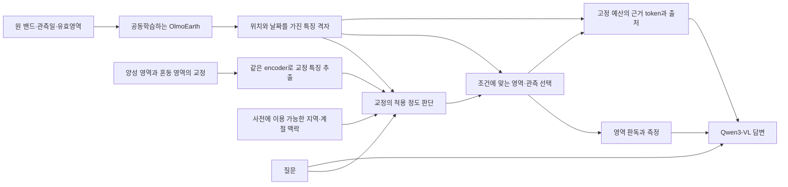

# 전문가의 구별 기준을 다른 환경에서도 쓰는 OlmoEarth VLM

> **후속: [설계 v5](OLMOEARTH_CROSSDOMAIN_LOOP_PLAN_20260927.md) · [PASTIS 실제 준비 결과](OE6_PASTIS_INPUT_PROGRESS_20260927.md).** 두 사례의 공학 입력과 날짜 수정·독립검산을 완료했다. 아래 v4의 당시 준비0개 상태는 이력이다. 새 비교 GPU 학습은 아직 미실행이다.

2026-09-27. 실제 VLM 연결 검사 이후의 연구 설계 v4. **새 방법의 성능·신규성 확정 또는 확증 사전등록이 아니다.** [GPU1 실행 결과](OE4_GPU1_VLM_PROGRESS_20260927.md)와 [첫 교정 전이 계획](OLMOEARTH_TRANSFER_FIRST_EXPERIMENT_20260927.md)을 연결한다.

연구할 가치가 있는 목표는 전문가가 알려준 **“이것을 찾되, 비슷하게 보이는 저것은 제외하라”는 구별 기준을 지역과 계절이 달라져도 재사용하는 모델**이다. 영상에서 찾은 위치·시점과 설명이 연결되고, 추가 라벨이 적게 들며, 학습한 OlmoEarth를 다른 판독기에 붙여도 도움이 되는지를 보인다. 식생·작물에서 시작해 홍수, 이후 해양 유사물질로 확장한다.

## 1. 무엇이 확인됐고 무엇이 아직 가설인가

| 구분 | 현재 근거 |
|---|---|
| 측정 완료 | 실제 Qwen3-VL의 언어 손실이 원본 OlmoEarth까지 전달됨. GPU1 FP32 1-step, encoder211개 gradient, 추적 가중치 변경. native 학습은 별도로8/32step·저장복원 통과 |
| 이번 구조 진단 | 현 연결부는 8×8공간×2시점=128개 EO token을16개로 평균. 각 묶음에 공간4개×시점2개가 포함됨 |
| 아직 측정 안 함 | 이 압축 때문에 실제 작물·홍수 판독이 실패하는지, 전문가 교정으로 회복되는지, 일반 공동학습보다 나은지 |
| 아직 구현 안 함 | 아래 제안 reader·교정 학습·VLM checkpoint 저장복원·실제 감독 episode |
| 지지되지 않는 주장 | 최초 EO–VLM, 최초 분광 VLM, 최초 few-shot EO 분할, 이미 CVPR급 효과를 발견했다는 주장 |

“연결이 된다”는 중요한 실행 기반이다. 과학적 기여는 그 기반 위에서 **기존의 강한 방법이 실패하는 조건과 그것을 고치는 학습 원리**를 함께 보여 주는 데 있다.

## 2. 가까운 선행이 이미 한 일

| 원 출처 | 확인된 겹침 | 우리가 더 입증해야 할 것 |
|---|---|---|
| [TerraScope](https://arxiv.org/html/2603.19039v1) | 마스크로 선택한 특징을 언어 생성에 재주입, 모달리티 선택과 시간 참조 | native 분광·시계열에서 교정의 새 환경 전이. 마스크+설명 자체는 차별점이 아님 |
| [SPEX](https://arxiv.org/html/2508.05202v2) | 다분광 encoder 공동학습, 텍스트 조건 분할·설명 | encoder를 업데이트했다는 사실 이상의 방법 효과 |
| [Earth-OneVision](https://arxiv.org/html/2606.10819v1) | 다중 센서·다층 특징 정렬, 분광 밴드의 pseudo-RGB 처리 | 동일 관측을 쓴 native EO 표현의 실질적 장점 |
| [SkySense-VITA](https://kang-wu.github.io/SkySense-VITA/) | 예시 이미지·텍스트로 새 영역/범주를 분할 | few-shot 적용을 넘어 구별 교정의 전이·라벨 비용·원 EO 표현의 개선 |
| [SkySense-O](https://openaccess.thecvf.com/content/CVPR2025/html/Zhu_SkySense-O_Towards_Open-World_Remote_Sensing_Interpretation_with_Vision-Centric_Visual-Language_Modeling_CVPR_2025_paper.html), [FarSLIP](https://arxiv.org/abs/2511.14901) | 언어 정렬 중 시각 표현 보존, 국소 정렬·distillation | SSL/보존 loss 추가 자체 이상의 필요성 |
| [AlignJEPA](https://arxiv.org/html/2608.15456) | frozen AnySat 표현의 다중 공간 규모 정렬과 learned query pooling | 실제 생성형 VLM·교정 전이·encoder 자체의 이득 |
| [WildSAT](https://arxiv.org/abs/2412.14428) | Wikipedia·생태 관측으로 위성 표현 학습 | 지역 지식을 넣는 것 이상의 과제별 교정 효과 |

SkySense-VITA의 [공식 저장소](https://github.com/kang-wu/SkySense-VITA)는 확인 시점에 코드·가중치·데이터 공개 대기 상태였다. 논문과의 개념 비교는 가능하지만 실행 가능한 baseline으로 세지 않는다. 대체 구현은 “저자 모델 재현”과 구분한다. 위 조사는 제한된 선행 대조이며 관련 연구의 부재를 증명하지 않는다. 상세 출처는 [문헌 검토](../artifacts/eo_vlm_design_20260927/prior_art.md).

## 3. 현재 코드에서 찾은 구체적인 개선 지점

현재 provider는 OlmoEarth 출력을 `Hpatch,Wpatch,T,bandset,D` 순서로 편 다음, 연결부에서 `adaptive_avg_pool1d`로16개를 만든다. 이번 입력은 `8×8×2×1×768`이다. **v1.2 출력의 bandset은1개이며, 출력 token을 개별 밴드 token이라고 해석하지 않는다.**

작은 CPU 진단은 고정된 encoder 출력에 대한 합성 사례를 정확한 유리수 연산으로 비교했다.

| 합성 특징의 변경 | 현재16개 평균 | 날짜를 분리한16개 평균 |
|---|---|---|
| 같은 위치에서 특징을 날짜0→1로 옮김 | 출력 같음 | 출력 다름 |
| 같은 묶음 안에서 가로 위치를 옮김 | 출력 같음 | 출력 같음 |
| 세로 인접 위치로 옮김 | 출력 다름 | 출력 같음 |

이는 특정 압축 연산의 구분 불가능한 경우를 보여 준다. **실제 영상의 날짜를 바꿨을 때 모델이 못 알아본다는 실험은 아니다.** encoder가 다른 token에 시간 정보를 중복 저장했을 수도 있다. 평균 행렬 rank16/nullity112도 “의미정보87.5%손실”로 해석하지 않는다. 날짜를 남기는 단순 수정은 같은 예산에서 공간 구분을 희생할 수 있다.

따라서 먼저 원 격자 특징, 현재 평균, 공간·시간을 나눈 평균, 충분히 학습한 resampler를 실제 정답 위에서 비교한다. 원 격자에서도 구별이 안 되면 연결부만의 문제라고 결론 내리지 않는다. 일반 resampler가 문제를 해결하면 더 복잡한 아키텍처의 필요성도 약해진다. [진단 결과](../artifacts/eo_vlm_design_20260927/connector_layout_audit.json) · [재실행 코드](../code/oe5_design/audit_connector_layout_v0.py).

## 4. 제안 아키텍처: 구별 교정을 시공간 근거에 적용한다

### 4.1 공간·시간 경로를 먼저 유지한다

OlmoEarth의 풍부한 격자 특징은 공간 판독까지 남기고, 언어모델에 줄 때만 압축한다. 날짜·센서·위치·validity를 별도 metadata로 함께 전달한다. 마스크와 답이 같은 관측을 참조하게 한다. 관측하지 않은 밴드/날짜는 availability로 표시하며 임의로0을 채우고 실측처럼 해석하지 않는다.

이 구조는 충분히 알려진 dense branch/conditioned reader의 조합이므로 자체 신규성을 주장하지 않는다. dense branch를 제안군에만 추가하지 않고 강한 일반 비교군에도 제공한다. 분광 축을 새로 보존하는 stem이나 Qwen의 깊은 층 결합은 첫 비교 뒤 필요할 때 추가한다. 현재 OlmoEarth에는 원 밴드가 들어가며, Qwen 출력 token에 밴드 이름만 붙이는 방식으로 분광 근거를 만들지 않는다.

### 4.2 양성 예시와 혼동 예시의 차이를 사용한다

교정 하나를 “대상 영역+확인된 혼동 영역+관측+정의”로 표현한다. support의 양성/혼동 영역을 같은 encoder로 읽고, query의 각 위치·날짜와 비교한다. 후보 연산은 양성 유사도에서 혼동 유사도를 뺀 지도와 지역 조건에 따른 적용 가중치를 결합하는 것이다.

예를 들어 홍수 양성만 외우는 대신, 영구수역과 구별해야 한다는 교정이 전후 SAR 관측에서 어디에 적용되는지 학습한다. 지역 맥락은 판독 기준의 적용을 보조하며 실제 관측을 대체하지 않는다. 첫 맥락은 고도·기후평년·관측 계절 같은 출처가 고정된 속성으로 제한하고, 국가명만으로 답하는 대조도 둔다.

**유사도 차이·cross-attention·지역 gate는 각각 새 발명이 아니다.** 시험할 것은 이런 구별 교정이 일반적인 모든 예시의 연결/attention보다 환경 전이와 혼동 오류에 도움이 되는지다. 효과가 없으면 추가 구조를 제거한다.

### 4.3 교정이 도움이 되는 조건을 학습한다

먼저 공통 `mask loss + 정답 문장 loss + 같은 native 학습 목적`으로 encoder와 연결부를 공동학습한다. Qwen은 첫 비교에서는 고정하고, 이후 같은 LoRA 조건을 모든 군에 적용하는 확장은 별도로 측정한다.

추가 학습 후보는 **교정별 실제 도움/피해를 예측하는 감독**이다. 학습 지역 내부에서 support 하나를 적용하기 전후의 query 손실 차이를 다른 fold/고정 checkpoint로 계산한다. 이를 교정 적용 점수의 목표로 쓴다. query와 support의 객체·footprint는 분리한다. 평가 query의 정답으로 support를 고르지 않는다.

이때 cross-fitting은 행 단위가 아니라 **원 지역·연도·parent tile 단위**로 나눈다. 같은 원영상의 이웃 crop이 utility 산출과 평가 양쪽에 들어가면 제외한다. support 검색, utility 산출, 최종 모델 선택에 쓴 정답과 계산비용을 장부에 함께 남긴다.

이 목표는 모델에 의존하는 utility이며 새 사람 정답이 아니다. 같은 utility 감독을 받은 일반 router/meta-reweighting을 필수 비교군으로 둔다. 생성하는 데 든 추가 forward/backward와 라벨 후보 library 비용을 모두 센다. 단순 native replay나 distillation만으로 충분한지도 확인한다. 아직 이 후보의 구체적 하이퍼파라미터·연산은 동결하지 않았다.

### 4.4 VLM이 맡아야 하는 가치

같은 교정을 “찾아라 → 이 영역만 보라 → 다른 날짜/대상과 비교하라”처럼 새 질의 조합에 재사용하도록 한다. 면적은 유효 mask와 올바른 격자에서 계산하고 VLM이 임의 수치를 만들게 두지 않는다. 설명은 선택한 영역/관측 ID와 짧은 근거로 평가하며 긴 추론문을 정답 근거로 삼지 않는다.

전문 분할기→정확한 연산→같은 VLM이 동등하게 잘하면, 그 결과를 VLM 내부 학습의 기여로 부르지 않는다. 단순 마스크·면적·설명 세 출력을 독립적인 능력 세 개로 중복 계산하지 않는다.

공간 판독 모듈의 기여와 언어 판독의 기여를 가르기 위해, **동일한 저장 mask·측정값을 두 reader에 제공하는 대조**를 둔다. OlmoEarth 자체의 이점은 학습 episode와 분리된 고정 EO 평가에서 확인한다. 기존 공식 평가 준비안의 Sen1Floods11·m_cashew_plant는 후보이며, 데이터 계약·중복 감사·원본 기준선 실행이 아직 필요하다.

## 5. 데이터는 두 코어와 한 확장으로 구성한다

아래는 공개 규모이며 확보·정합·학습 완료 수량이 아니다. 센서와 라벨이 다른 자료를 동일 장면의 멀티모달 관측인 것처럼 합치지 않는다.

| 자료·출처 | 연구에서 쓰는 역할 | 해결해야 할 입력/정답 제약 |
|---|---|---|
| [PASTIS/PASTIS-R](https://github.com/VSainteuf/pastis-benchmark): 2,433패치, S2시계열·작물/필지; R은S1추가 | 작물 양성·혼동 필지의 교정, 영역 찾기, 같은 개념의 지역 내/밖 재사용 | S2 10→12밴드·결측·정규화·원 취득일. 연간 작물 정답으로 건강·고사·변화일 정답을 만들지 않음 |
| [Kuro Siwo](https://arxiv.org/html/2311.12056v3): 43사건, 전2회·후1회SAR, 전문가5명 교차검수 | 영구수역과 새 홍수의 구별, 시간 근거, 사건 간 교정 전이 | GRD sigma0와 OlmoEarth S1 전처리 정합·valid mask. 전문가 mask는 자연어 교정 기록이 아님 |
| [MADOS](https://zenodo.org/records/10664073): 174scene·2,803crop·15클래스 | 해양 쓰레기와 유사 물질의 혼동/불확실성 평가 | sparse labels의 빈 곳은 음성이 아님. Rayleigh 반사도는 S2 L2A와 다름. 개별 쓰레기·질량·장기 증가 정답 없음 |

Kuro는 이 프로젝트에서 이전에 사용한 자료다. [9/9 기록](STREAMING_RESEARCH_UPDATE_2026_09_09.md)에는 test 결과 관찰과 제외 사례가 이미 있다. **이전 관찰 사건은 개발 자료로 취급한다. 공식 test 명칭만으로 새 확증 holdout이 되지 않는다.** 새 분야를 입증할 때는 과거 실행/분석과 사건 ID를 대조하고, 실제 미관찰 사건 또는 별도 자료를 확보해야 한다. 반복 개발 결과를 독립 확인처럼 제시하지 않는다.

자료 권리는 사용할 버전의 metadata에 고정한다. Kuro의 [현행 공식 카드](https://huggingface.co/datasets/orion-ai-lab/Kuro-Siwo-GeoTIFFs)는 CC-BY-4.0이며 과거 논문 표기와 구분한다. PASTIS/MADOS 원데이터 권리는 코드 라이선스로 대체하지 않는다. S4A는 국가 전이 확장 후보지만 L1C/L2A 차이를 먼저 해결한다. 상세 접근 경로는 [자료 조사](../artifacts/eo_vlm_design_20260927/data.md).

기존 100만원 계획은 유지한다: 검수72만원·전문검토16만원·API상한5만원·예비7만원의 가정이며 발주/지출이 아니다. 자동 생성 공개 라벨 support와 실제 전문가 교정을 구분한다. 원 [예산안](../config/eo_vlm_labeling_budget_v2_20260926.json)의 20개 시간 측정 pilot, train200/dev60/독립2인test120 목표를 유지하고 원자료 수와 질문 수를 따로 센다. 데이터 조사자의100인시/600episode안은 대안 산식이며 채택하거나 확보한 계획이 아니다. AI는 문장 후보와 검수 우선순위를 만들고, 합의율을 정답률로 사용하지 않는다.

첫 episode는 **정해진 작물 쌍 또는 홍수/영구수역의 혼동**, 출처가 있는 support 영역, 분리된 query 필지/사건, 그에 맞는 질문과 정답으로 정의한다. 같은 환경의 교정과 다른 환경의 교정을 같은 수로 비교한다. 교정이 없어도 작동하는 일반 reader에는 무교정 대조를 두되, prototype이 정의되지 않는 K=0을 억지로 만들지 않는다. PASTIS 첫 실험이 보이는 것은 지역 간 작물 구분 전이이며, 미지의 생태 개념·계절 변화 판독은 별도 정답과 클래스/사전학습 노출 감사 후의 확장이다.

## 6. 어떤 실험이 주장을 만들 수 있는가

| 비교 | 답하려는 질문 |
|---|---|
| 원 OlmoEarth 격자 + 동일 용량 readout vs 평균/격자압축/학습 resampler | 원 특징에서 구별되던 실제 라벨 정보를 어떤 경로가 잃는가? |
| 같은입력 A0 일반 reader vs A1 구별 교정 reader | 구조가 개선에 필요한가? |
| 같은구조 L0 일반 공동학습 vs L1 교정 utility/paired 감독 | 학습 방식의 이득이 남는가? |
| A0L0/A0L1/A1L0/A1L1의2×2 | 제안군만 더 좋은 정보·감독을 받아 이긴 것은 아닌가? |
| 전문분할+연산+동일VLM | 실제 VLM 결합이 조건 질의와 교정 재사용에서 도움이 되는가? |
| 새 연결부/다른reader, 별도 EO 평가 | OlmoEarth 자체에 재사용 가능한 이점이 남는가? |

모든 핵심 군에 같은 RGB/원 EO 관측·질문·양성/혼동 교정·맥락·mask 감독·native replay·dense head를 준다. encoder trainable 범위와 warmup/학습/튜닝 예산도 맞춘다. 처음 M=64 EO token을 공통 개발점으로 두고16/128은 토큰 예산 곡선으로 비교한다. M은 아직 확정 recipe가 아니다. 원격GPU 처리량을 실측해 실행 가능한 값을 동결한다. 전체 특징 baseline은 성능 상한 참고이며 같은 계산비용인 것처럼 부르지 않는다.

일반 대조에는 충분히 학습한 episodic/prototype 모델과 learned resampler를 포함한다. 제안군과 같은 양성·혼동 예시 및 utility 감독을 주고, 단순 모델에 token을 더 주는 비용–성능 비교도 한다. 같은 token 수가 같은 FLOPs·GPU 시간·파라미터 수를 뜻하지 않으므로 각각 보고한다. 현재 flattened 16-token 평균 하나만 이기는 결과는 연결부 수리의 근거로만 해석한다.

주결과는 봉인한 지역/사건에서 **같은 품질에 필요한 독립 교정 수**, foreground IoU와 혼동 오탐, 그리고 대상·질문 조건·근거가 함께 맞는 답변 비율이다. K=1/5/20 곡선과 전체 교정 후보 library의 검수비용을 같이 보고한다. 필요한 날짜의 정답이 없는 자료에서는 날짜 설명을 평가 정답으로 만들지 않는다. 지역 단위 paired 효과와 불확실성을 보고하고 pixels/질문 수를 독립 표본으로 세지 않는다.

내용 통제는 질문-only/맥락-only, 관측 교체, 교정 조건 변경을 포함한다. 관측을 가린 뒤 동일 정답이 유효한지 별도로 판단한다. 날짜 배열 순서만 바꾸되 원 날짜를 함께 유지하는 검사와 영상에 잘못된 날짜를 붙이는 스트레스 검사를 구분한다. 후자는 새 ground truth를 자동으로 만들지 않는다. wrong-context 저하만으로 맥락의 유용성을 입증하지 않는다.

## 7. 실행 순서와 확대 기준

1. **지금 완료:** GPU1 연결·gradient 검사, 근접 선행/자료 검토, 현재 압축 연산의 작은 CPU 진단. 의미 성능·새 GPU 학습은 이번에 추가하지 않았다.
2. **바로 다음:** 기존 PASTIS shard 무결성과 원 입력을 확인해 공개 라벨이 연결된2사례를 만든다. 동시에 Kuro의 원 입력·과거 사건 노출 장부를 확인한다. 변환에 실패하면 정확한 blocker와 대체자료 조건을 남긴다.
3. **첫 모델 실험:** 같은 개발 관측에서 원 격자→평균/격자/학습 resampler의 판독 차이를 본다. 충분히 학습한 일반 VLM baseline과 checkpoint 저장복원도 여기서 완료한다. 이것이 아직 준비되지 않은 실제200~1,000관측 개발 pilot의 출발점이며 통계 검증 수량은 독립 지역/사건 수에 따른다.
4. **방법 실험:** 드러난 오류에 맞춰 최소한의 구별 교정 구조와2×2를 실행한다. 일반 cross-attention이나 같은정보router로 효과가 설명되면 새 원리의 주장을 줄인다.
5. **확대:** 여러 support draw/개발 지역에서 효과가 반복되고 비용이 확인되면 새 봉인 평가, 실제 전문가 교정, 두 번째 분야, 새 reader로 확장한다. 10k/100k 규모는 원관측/예산/중복감사를 통과한 뒤 결정한다. 지금1M학습을 약속하지 않는다.

CVPR 수준의 방법 주장에는 **실제 반복되는 실패 현상 → 강한 대조보다 나은 메커니즘 → 새 환경의 교정 비용 절감 → OlmoEarth에 남는 이점**이 함께 필요하다. 새 데이터와 모듈을 많이 붙인 것만으로 이를 대신하지 않는다. 현재는 실행할 이유와 비교 설계를 확보한 상태이며 채택 확률을 수치화할 근거는 없다.

독립 검토의 다섯 지적과 반영 위치는 [검토 대응](../artifacts/eo_vlm_design_20260927/review_response.md)에, 원 검토는 [별도 원문](../artifacts/eo_vlm_design_20260927/final_design_redteam.md)에 보존한다. 동반 개발 설정은 [JSON](../config/oe5_architecture_data_development_v1_20260927.json)이며 실행 준비 완료를 뜻하지 않는다.
