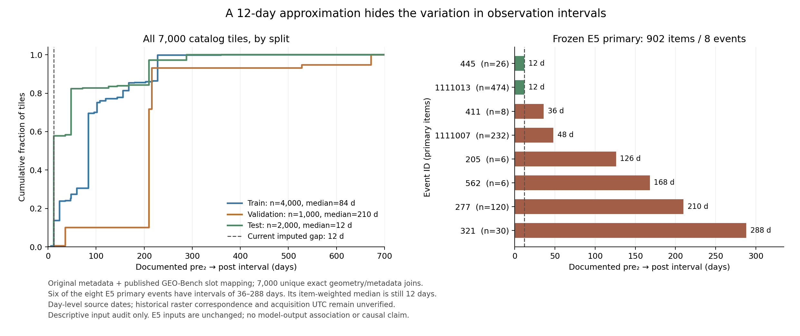

# T0 원 관측 날짜 감사: 전체 catalog와 E5 고정 표본

2026-09-25. **확인한 것은 원저자의 날짜 metadata와 공개 변환 코드의 연결이다. 현재 tortilla를 만든 정확한 실행 revision, 원 raster 값의 대응, Sentinel 제품의 정확한 UTC 취득시각까지 복구한 것은 아니다.** 날짜를 확인했다고 pre 영상의 무침수나 실제 변화 발생시점이 검증되는 것도 아니다. 이번 감사는 모델 예측·점수·E5 결과를 읽지 않은 기술통계이며 기존 실험 입력·표본·정답·판정은 바꾸지 않았다.

그 범위에서, 현재 7,000타일 모두 원저자 grid와 유일하게 정확히 연결됐고, 사전등록된 E5 주 평가 902문항의 날짜 진단도 독립 계산에서 일치했다. 핵심은 **전체 catalog, 각 split, 실제 평가 표본의 간격 분포가 서로 다르다**는 점이다.

## 근거와 독립 검증

T0는 기존 tortilla의 상위 metadata만 읽었다. 사건/AOI와 EPSG:3857 전체 224×224 타일의 네 꼭지점을 정확히 연결하고, 사건일·pcovered·pwater·pflood 등을 대조했다. 최근접 좌표나 반올림 중심점으로 대체하지 않았다. 원저자 67,490-grid metadata와의 유일 조인은 7,000/7,000개, split은 train 4,000 / validation 1,000 / test 2,000이다. 공개 코드 계약의 pre₁<pre₂<post 순서도 7,000개 모두 성립했다. [T0 manifest](/Users/dongdong/DongDong/ai_projects/eo_olmo_earth_project/artifacts/t0_source_date_join_v0_20260925/manifest.json)

별도 검토는 생산 join/export 함수를 호출하지 않고 7,000개 identity, 네 꼭지점, 원 필드 42,000회, 날짜 21,000개 및 요약 통계를 다시 대조해 일치를 확인했다. 입력 metadata를 해석하는 제한 parser는 재사용했으므로 독립성의 범위는 조인·비교·통계 계산이다. [전체 독립 감사](/Users/dongdong/DongDong/ai_projects/eo_olmo_earth_project/artifacts/T0_INDEPENDENT_RESULT_REVIEW_20260925.json)

이번 E5 표본 재검토는 T0의 저장 gap을 그대로 인용하지 않고 `raw_sources.source_date`에서 날짜 차이를 다시 계산했다. 주 평가 집합도 C1 결과/모델 점수를 읽지 않고 동결된 `items.jsonl`, label-quality 기록, selected IDs에서 재구성했다. 4,569개 홍수 문항의 모든 날짜 진단 행과 7개 집단 요약을 비교한 불일치는 0이다. [기존 표본 진단](/Users/dongdong/DongDong/ai_projects/eo_olmo_earth_project/artifacts/T0_E5_POPULATION_DATE_DIAGNOSTIC_20260925.json), [독립 재계산](/Users/dongdong/DongDong/ai_projects/eo_olmo_earth_project/artifacts/T0_E5_POPULATION_DATE_DIAGNOSTIC_INDEPENDENT_20260925.json)

## 전체 7,000타일: 최근 pre에서 post까지

아래는 **타일마다 같은 가중치**를 준 `pre_2 → post` 날짜 간격이다. `날짜쌍 일치`는 두 날짜가 기존 사건일−12일/사건일과 각각 같다는 뜻이다. `간격 12일`은 두 날짜가 같은 만큼 이동했더라도 성립할 수 있으므로 별도 수치다.

| 범위 | 타일 / 사건 | 간격 중앙값 | 최소–최대 | 날짜쌍 일치 | 간격 12일 |
|---|---:|---:|---:|---:|---:|
| 전체 | 7,000 / 43 | 84일 | 6–672일 | 196 | 1,690 |
| train | 4,000 / 27 | 84일 | 6–360일 | 137 | 528 |
| validation | 1,000 / 6 | 210일 | 12–672일 | 0 | 6 |
| test | 2,000 / 10 | 12일 | 12–288일 | 59 | 1,156 |

전체 최대 672일은 validation에 속한다. 이를 E5 주 평가의 최대 간격이나 E5 test 전체의 간격이라고 인용하면 안 된다. 전체 84일과 test 12일의 중앙값 역시 서로 다른 모집단의 기술통계다.

## 실제 E5 입력 집합

E5는 C0에서 동결한 train/test 문항을 쓴다. 전체 5,989문항 중 이 T0 감사가 다루는 Sentinel-1 홍수 문항은 train 3,198개(2,132타일), test 1,371개(914타일)다. 나머지 landslide 문항의 날짜는 이번 감사 대상이 아니다. validation 1,000타일은 현재 E5 train/test 문항에 포함되지 않는다.

`pos`와 `hard_neg`는 pre₂/post를, `neg`는 pre₁/pre₂를 사용한다. 따라서 아래 표의 각 행은 **문항에 실제 제시된 두 슬롯 사이의 간격**이며 세 종류를 전부 pre₂/post 통계처럼 합치면 안 된다. pos와 neg에는 같은 타일의 서로 다른 질문이 있다.

| E5 집단 | 문항 / 사건 | 간격 중앙값 | 최소–최대 | 날짜쌍 일치 | 기존 12일 간격 일치 |
|---|---:|---:|---:|---:|---:|
| train pos | 1,066 / 24 | 84일 | 12–228일 | 9 | 91 |
| train neg | 1,066 / 24 | 12일 | 12–48일 | 9 | 955 |
| train hard_neg | 1,066 / 26 | 84일 | 6–360일 | 51 | 162 |
| test pos | 457 / 10 | 12일 | 12–288일 | 9 | 270 |
| test neg | 457 / 10 | 12일 | 12–48일 | 9 | 408 |
| test hard_neg | 457 / 8 | 12일 | 12–288일 | 17 | 232 |
| C1/E5 주 평가 | 902 / 8 | 12일 | 12–288일 | 26 | 500 |

주 평가는 대칭 label-quality 기준을 만족한 907개 중 같은 `(event, 기존 dates, slots)` 안에 pos와 hard_neg 양쪽이 있는 902개다. 독립적으로 **445 pos + 457 hard_neg, 8사건, 8 strata, 902개 고유 타일**을 재구성했다. 이 포함 기준은 기존에 동결돼 있었으며, 이번에 복구한 날짜를 보고 표본을 다시 고른 것이 아니다.

## 주 평가의 12일 중앙값을 어떻게 읽어야 하는가

902개 중 날짜쌍이 모두 기존 문자열과 같은 문항은 **26개(2.88%)**다. “개별 날짜 문자열 26개”가 아니다. 개별 슬롯 날짜의 일치 횟수는 1,804회 중 172회다. 간격만 기존 12일과 같은 문항은 **500개(55.43%)**다.

| 사건 | pos / hard_neg | 타일 수 | pre₂→post | 두 날짜 모두 일치 |
|---|---:|---:|---:|---:|
| 205 | 4 / 2 | 6 | 126일 | 0 |
| 277 | 48 / 72 | 120 | 210일 | 0 |
| 321 | 19 / 11 | 30 | 288일 | 0 |
| 411 | 1 / 7 | 8 | 36일 | 0 |
| 445 | 9 / 17 | 26 | 12일 | 26 |
| 562 | 4 / 2 | 6 | 168일 | 0 |
| 1111007 | 101 / 131 | 232 | 48일 | 0 |
| 1111013 | 259 / 215 | 474 | 12일 | 0 |

사건 1111013 하나가 474/902개(52.55%)를 차지한다. 이 사건은 두 날짜가 함께 이동해 12일 간격은 유지하지만 기존 날짜쌍과는 일치하지 않는다. 사건 445의 26개를 더하면 간격 일치 500개가 된다.

타일 수로 가중하면 평균 간격은 **58.79일**, 중앙값은 12일이다. 각 사건에 같은 가중치를 주면 평균 간격은 **112.5일**이며, 12일 간격인 사건은 **2/8개(25%)**, 12일이 아닌 사건은 **6/8개(75%)**다. 이 주 평가 집합에서는 사건마다 간격이 하나여서 두 사건 비율을 직접 계산할 수 있다. E5의 주 성능 지표는 사건을 균등하게 평균하므로, 입력 조건을 설명할 때도 타일 가중 수치만 제시해서는 안 된다. 이 기술통계는 성능 지표를 다시 계산하거나 검정 단위를 바꾼 것이 아니다.

## 논문과 후속 구현에서 허용되는 결론

근거 있는 설명은 “고정된 홍수 문항의 합성 날짜와 공개 원자료 날짜 사이에 체계적인 차이가 있으며, 그 차이는 평가 집합과 사건에 따라 다르다”이다. 전체 입력 계약을 출처에 맞게 점검할 수 있는 artifact가 생겼고, 엔지니어링 시스템의 사건일·관측일·unknown을 분리할 구체적인 이유를 얻었다.

이 결과만으로 **모델이 날짜 오류 때문에 실패했다**, **계절성만 읽었다**, **기억이 병목이다**, **날짜만 고치면 실제 변화 이해가 해결된다**고 결론낼 수는 없다. 모델 출력과 날짜의 관계를 이번 감사에서 분석하지 않았다. 관측 간격이 길면 계절·토지피복 변화 등 다른 차이를 검토할 필요가 있지만, 여기서는 그 원인이나 영향 크기를 측정하지 않았다.

날짜는 원저자 일 단위 metadata와 공개 GEO-Bench mapping의 조합이다. source UUID의 제품명/정확 UTC 시각, 현재 raster와의 값 대응, 원 실행 계보는 별도 확인이 필요하다. 그리고 post flood mask만으로 pre의 무침수나 변화 발생시각을 알 수 없다. source label과 물리적인 변화 정답은 계속 구분해야 한다.

E5는 기존 동결 입력에 대한 동일 예산 비교로 남긴다. 후속 데이터 계약에서 검증된 관측일과 그 근거 상태를 별도로 저장하고, 원 raster 연결과 전후 장면 정답을 확인한 뒤 시간 관계 평가를 설계하는 것이 적절하다. 이번 사후 감사로 E5를 재실행하거나 표본·성공 기준을 바꾸지는 않는다.

## 재현 그림과 코드

그림은 데이터의 시간 조건을 보여주며 모델 성능을 표시하지 않는다. [PDF](../artifacts/t0_source_date_figure_20260925/source_date_intervals.pdf), [그림 입력·출력 SHA](../artifacts/t0_source_date_figure_20260925/plot_provenance.json), [재현 코드](../code/plot_t0_source_date_audit_20260925.py).

원저자 metadata의 고정 revision은 `4347ed173c4e48f5a9d578bb5fe8453706b08e5e`이고, [공개 GEO-Bench 생성 코드](https://github.com/The-AI-Alliance/GEO-Bench-2/blob/d7ae6aafc18e1da1bd6efb130f0a306125ee0fef/geobench_v2/generate_benchmark/kuro_siwo.py)의 고정 mapping과 대조했다. 현재 raster가 그 revision으로 만들어졌다는 뜻은 아니다. [원자료 패키지 manifest](../artifacts/kuro_original_metadata_pin_20260925/MANIFEST.json)에 원파일·revision·해시를 보존했다.
